# Core del Negocio

## Descripción

El core del negocio de YoUSAC consiste en centralizar el acceso, reproducción y gestión de contenido académico digital, facilitando a estudiantes y docentes el acceso al conocimiento universitario.

## Diagrama del Core del Negocio

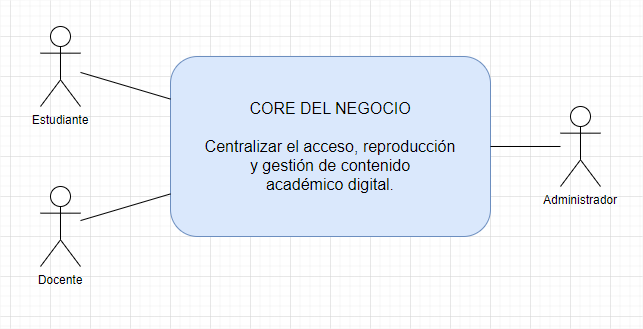

**Figura 1.** Core del negocio de la plataforma YoUSAC.

## Actores del Negocio

| Actor | Descripción |
|-------|-------------|
| Estudiante | Usuario principal de la plataforma. Consulta el catálogo académico y reproduce contenido educativo disponible. |
| Docente | Usuario que consulta contenido académico y participa en la gestión o disponibilidad del material educativo según sus permisos. |
| Administrador | Responsable de gestionar usuarios, asignaciones, roles y permisos dentro de la plataforma. |

## Capacidades Principales del Negocio

| Capacidad | Descripción |
|-----------|-------------|
| Autenticación Institucional | Permite validar la identidad de los usuarios mediante sus credenciales institucionales y determinar sus roles y permisos. |
| Catálogo y Búsqueda Académica | Permite consultar, buscar y filtrar el contenido académico disponible utilizando diferentes criterios como curso, docente y escuela. |
| Reproducción de Clases | Permite acceder y reproducir contenido académico, conservar el progreso de reproducción y continuar posteriormente desde el último punto registrado. |
| Gestión de Asignaciones y Permisos | Permite administrar usuarios, asignar cursos, gestionar roles y configurar los permisos necesarios para acceder a las funcionalidades y contenidos de la plataforma. |

## Relación entre Actores y Capacidades

| Actor | Capacidades relacionadas |
|-------|--------------------------|
| Estudiante | Autenticación Institucional, Catálogo y Búsqueda Académica, Reproducción de Clases |
| Docente | Autenticación Institucional, Catálogo y Búsqueda Académica |
| Administrador | Autenticación Institucional, Gestión de Asignaciones y Permisos |

## Objetivo del Core

El objetivo principal del core del negocio es proporcionar una plataforma centralizada que facilite el acceso al contenido académico universitario, permitiendo su consulta y reproducción de manera controlada según el perfil y los permisos de cada usuario.

---
# Primera Descomposición del Core del Negocio

## Descripción

La primera descomposición del Core del Negocio divide la funcionalidad principal de YoUSAC en cuatro capacidades de negocio independientes. Cada capacidad agrupa responsabilidades relacionadas y establece un límite funcional que posteriormente servirá como referencia para definir los componentes y servicios de la arquitectura.

## Diagrama de Primera Descomposición

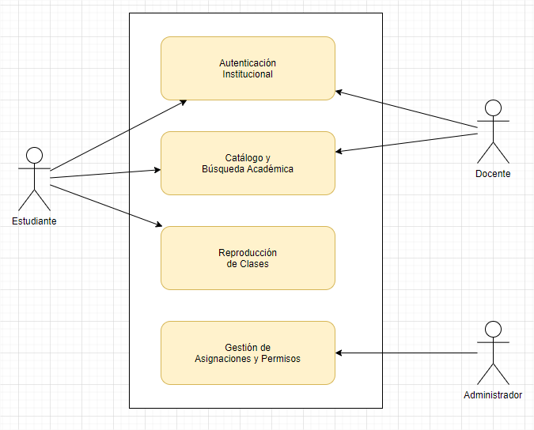

**Figura 2.** Primera descomposición del Core del Negocio de la plataforma YoUSAC.

## Capacidades de Negocio

| Capacidad | Descripción | Actor(es) principal(es) |
|-----------|-------------|-------------------------|
| Autenticación Institucional | Permite validar la identidad de los usuarios mediante sus credenciales institucionales, establecer una sesión y determinar los roles y permisos asociados. | Estudiante, Docente, Administrador |
| Catálogo y Búsqueda Académica | Permite consultar y localizar contenido académico mediante búsquedas y filtros relacionados con cursos, docentes y escuelas. | Estudiante, Docente |
| Reproducción de Clases | Permite acceder y reproducir contenido académico, conservar el progreso de reproducción y continuar posteriormente desde el último punto registrado. | Estudiante |
| Gestión de Asignaciones y Permisos | Permite administrar usuarios, asignar cursos, gestionar roles y configurar los permisos de acceso a las funcionalidades y contenidos. | Administrador |

## Responsabilidades por Capacidad

### 1. Autenticación Institucional

| Responsabilidad | Descripción |
|-----------------|-------------|
| Ingresar credenciales | Recibir las credenciales proporcionadas por el usuario. |
| Validar dominio institucional | Verificar que la cuenta utilizada pertenezca al dominio institucional autorizado. |
| Autenticar usuario | Validar las credenciales contra la información registrada. |
| Generar sesión | Crear una sesión válida para el usuario autenticado. |
| Asignar roles | Determinar los roles y permisos correspondientes al usuario. |

### 2. Catálogo y Búsqueda Académica

| Responsabilidad | Descripción |
|-----------------|-------------|
| Consultar catálogo | Obtener el contenido académico disponible. |
| Buscar videos | Localizar contenido utilizando términos de búsqueda. |
| Filtrar por curso | Limitar los resultados según el curso seleccionado. |
| Filtrar por docente | Limitar los resultados según el docente seleccionado. |
| Filtrar por escuela | Limitar los resultados según la escuela seleccionada. |
| Consultar información del video | Mostrar información detallada del contenido seleccionado. |
| Visualizar resultados | Presentar al usuario los resultados obtenidos. |

### 3. Reproducción de Clases

| Responsabilidad | Descripción |
|-----------------|-------------|
| Seleccionar video | Identificar el contenido académico que será reproducido. |
| Verificar permisos | Validar que el usuario tenga autorización para acceder al contenido. |
| Cargar video | Preparar el contenido para su reproducción. |
| Reproducir clase | Permitir la reproducción del contenido académico. |
| Guardar progreso | Registrar periódicamente el avance del usuario. |
| Reanudar reproducción | Permitir continuar desde el último punto registrado. |
| Calificar clase | Registrar la valoración realizada por el usuario. |

### 4. Gestión de Asignaciones y Permisos

| Responsabilidad | Descripción |
|-----------------|-------------|
| Administrar usuarios | Crear, consultar, modificar o gestionar usuarios de la plataforma. |
| Asignar cursos | Asociar cursos a los usuarios correspondientes. |
| Asignar roles | Determinar los roles que tendrá cada usuario. |
| Configurar permisos | Definir las acciones y recursos a los que puede acceder cada usuario. |
| Guardar configuración | Persistir los cambios realizados en asignaciones y permisos. |
| Consultar asignaciones | Consultar las asignaciones existentes de usuarios y cursos. |

## Relación con los Casos de Uso

| Capacidad de Negocio | Caso de Uso Principal |
|----------------------|-----------------------|
| Autenticación Institucional | Autenticación Institucional |
| Catálogo y Búsqueda Académica | Catálogo y Búsqueda Académica |
| Reproducción de Clases | Reproducción de Clases |
| Gestión de Asignaciones y Permisos | Gestión de Asignaciones y Permisos |

## Resultado de la Descomposición

La primera descomposición establece cuatro límites funcionales claramente diferenciados dentro del negocio. Estos límites permiten organizar las responsabilidades del sistema sin definir todavía una implementación tecnológica específica.

Esta separación servirá posteriormente como base para identificar los componentes de software, establecer sus responsabilidades y determinar las fronteras de los microservicios que conformarán la arquitectura de YoUSAC.

---
# Requerimientos Funcionales

| ID | Requerimiento Funcional | Descripción | Prioridad |
|----|-------------------------|-------------|-----------|
| RF-01 | Autenticación Institucional | El sistema deberá permitir a los usuarios autenticarse utilizando sus credenciales institucionales. | Alta |
| RF-02 | Validación del Dominio Institucional | El sistema deberá validar que el correo electrónico utilizado para autenticarse pertenezca al dominio institucional autorizado. | Alta |
| RF-03 | Gestión de Sesiones | El sistema deberá generar y administrar sesiones autenticadas para los usuarios que hayan sido validados correctamente. | Alta |
| RF-04 | Gestión de Roles y Permisos | El sistema deberá identificar el rol del usuario autenticado y aplicar los permisos correspondientes según su perfil. | Alta |
| RF-05 | Consulta del Catálogo Académico | El sistema deberá permitir a los usuarios consultar el catálogo de contenido académico disponible. | Alta |
| RF-06 | Búsqueda de Contenido Académico | El sistema deberá permitir buscar videos y clases utilizando términos relacionados con el contenido académico. | Alta |
| RF-07 | Filtrado por Curso | El sistema deberá permitir filtrar el contenido académico según el curso seleccionado. | Alta |
| RF-08 | Filtrado por Docente | El sistema deberá permitir filtrar el contenido académico según el docente asociado al contenido. | Media |
| RF-09 | Filtrado por Escuela | El sistema deberá permitir filtrar el contenido académico según la escuela o unidad académica correspondiente. | Media |
| RF-10 | Consulta de Información del Contenido | El sistema deberá mostrar información detallada del contenido académico seleccionado. | Alta |
| RF-11 | Reproducción de Clases | El sistema deberá permitir a los usuarios autorizados reproducir el contenido académico disponible en la plataforma. | Alta |
| RF-12 | Verificación de Acceso al Contenido | El sistema deberá verificar que el usuario tenga los permisos necesarios antes de permitir la reproducción de contenido restringido. | Alta |
| RF-13 | Registro del Progreso de Reproducción | El sistema deberá registrar el progreso de reproducción de cada usuario para los contenidos que haya comenzado a visualizar. | Alta |
| RF-14 | Reanudación de Reproducción | El sistema deberá permitir al usuario continuar la reproducción de una clase desde el último punto de progreso registrado. | Alta |
| RF-15 | Calificación del Contenido | El sistema deberá permitir a los usuarios calificar el contenido académico después o durante su reproducción. | Media |
| RF-16 | Gestión de Usuarios | El sistema deberá permitir al administrador consultar y gestionar los usuarios registrados en la plataforma. | Alta |
| RF-17 | Asignación de Cursos | El sistema deberá permitir al administrador asignar cursos a los usuarios de acuerdo con las reglas y permisos establecidos. | Alta |
| RF-18 | Asignación de Roles | El sistema deberá permitir al administrador asignar o modificar los roles de los usuarios autorizados. | Alta |
| RF-19 | Configuración de Permisos | El sistema deberá permitir al administrador configurar los permisos asociados a los roles y usuarios de la plataforma. | Alta |
| RF-20 | Consulta de Asignaciones | El sistema deberá permitir al administrador consultar las asignaciones de cursos, roles y permisos asociadas a cada usuario. | Media |
| RF-21 | Administración del Contenido Académico | El sistema deberá permitir gestionar el contenido académico disponible en la plataforma, incluyendo su registro, actualización y disponibilidad. | Alta |
| RF-22 | Registro del Historial de Reproducción | El sistema deberá registrar el historial de contenidos reproducidos por cada usuario. | Media |
| RF-23 | Consulta de Contenido por Usuario | El sistema deberá permitir identificar el contenido académico disponible para un usuario de acuerdo con sus asignaciones y permisos. | Media |
| RF-24 | Gestión de Errores Funcionales | El sistema deberá informar al usuario cuando una operación no pueda completarse debido a credenciales inválidas, permisos insuficientes, contenido no disponible o errores durante la operación. | Media |

---
# Requerimientos No Funcionales

| ID | Atributo de Calidad | Requerimiento No Funcional | Métrica / Criterio de Aceptación |
|----|----------------------|----------------------------|-----------------------------------|
| RNF-01 | Rendimiento | El sistema deberá responder a las operaciones de autenticación en un tiempo máximo de 2 segundos. | El 95% de las solicitudes deberá completarse en ≤ 2 segundos bajo carga normal. |
| RNF-02 | Rendimiento | El sistema deberá responder a las consultas del catálogo y búsquedas académicas en un tiempo máximo de 2 segundos. | El 95% de las consultas deberá completarse en ≤ 2 segundos. |
| RNF-03 | Rendimiento | El sistema deberá procesar las solicitudes de reproducción sin generar retrasos perceptibles durante el inicio del contenido. | El inicio de reproducción deberá producirse en ≤ 3 segundos en condiciones normales de red. |
| RNF-04 | Escalabilidad | La plataforma deberá soportar múltiples usuarios accediendo simultáneamente a los servicios principales. | Deberá soportar al menos 500 usuarios concurrentes sin superar los límites de rendimiento establecidos. |
| RNF-05 | Disponibilidad | La plataforma deberá mantenerse disponible durante el horario de operación establecido. | Disponibilidad mínima mensual del 99.5%, excluyendo mantenimientos programados. |
| RNF-06 | Seguridad | La comunicación entre los componentes de la plataforma deberá realizarse mediante canales seguros. | El 100% de las comunicaciones externas deberá utilizar HTTPS/TLS y las comunicaciones gRPC deberán utilizar canales protegidos. |
| RNF-07 | Seguridad | Las credenciales de los usuarios no deberán almacenarse en texto plano. | Las contraseñas deberán almacenarse utilizando un algoritmo de hash seguro y con mecanismos de protección contra ataques de fuerza bruta. |
| RNF-08 | Seguridad | El acceso a las funcionalidades deberá estar controlado mediante roles y permisos. | El 100% de las operaciones protegidas deberá validar la autorización del usuario antes de ejecutarse. |
| RNF-09 | Seguridad | Las sesiones de usuario deberán contar con un mecanismo de expiración. | Las sesiones autenticadas deberán expirar después de un período máximo de 60 minutos de inactividad. |
| RNF-10 | Integridad | La plataforma deberá garantizar la integridad de los datos almacenados en cada servicio. | El 100% de las operaciones de persistencia deberá validar las restricciones de integridad correspondientes. |
| RNF-11 | Disponibilidad | La falla de un microservicio no deberá provocar la caída completa de la plataforma. | Los servicios no afectados deberán continuar operativos ante la indisponibilidad de un microservicio independiente. |
| RNF-12 | Mantenibilidad | Cada microservicio deberá mantener una separación clara de responsabilidades. | Cada servicio deberá poseer su propio código, configuración y mecanismo de persistencia, sin acceso directo a la base de datos de otro servicio. |
| RNF-13 | Interoperabilidad | Los microservicios deberán comunicarse mediante contratos gRPC definidos formalmente. | El 100% de las comunicaciones internas entre microservicios deberá utilizar interfaces gRPC documentadas mediante archivos `.proto`. |
| RNF-14 | Portabilidad | Los componentes de la plataforma deberán poder ejecutarse en ambientes de desarrollo, pruebas y producción sin modificaciones significativas en el código fuente. | La aplicación deberá poder desplegarse mediante contenedores Docker en los ambientes definidos. |
| RNF-15 | Observabilidad | La plataforma deberá registrar los eventos relevantes de operación y errores. | El 100% de las solicitudes críticas deberá generar registros con fecha, servicio, operación y resultado. |
| RNF-16 | Recuperabilidad | La plataforma deberá permitir recuperar la información ante una falla de almacenamiento. | Las bases de datos deberán contar con respaldos periódicos y un mecanismo de restauración probado. |
| RNF-17 | Usabilidad | La interfaz deberá permitir a los usuarios completar las operaciones principales sin conocimientos técnicos. | Las funciones principales deberán ser accesibles en un máximo de 3 interacciones desde la pantalla principal. |
| RNF-18 | Compatibilidad | La plataforma web deberá funcionar correctamente en los navegadores modernos más utilizados. | Deberá ser compatible con las dos últimas versiones estables de Chrome, Edge y Firefox. |
| RNF-19 | Auditabilidad | Las operaciones administrativas relacionadas con usuarios, roles, permisos y asignaciones deberán ser auditables. | El 100% de las operaciones administrativas deberá registrar usuario, fecha, operación y resultado. |
| RNF-20 | Calidad | El código de los microservicios deberá cumplir estándares definidos de calidad y consistencia. | El código deberá contar con análisis estático y pruebas automatizadas para los componentes críticos antes de su integración. |

---
# Caso de Uso: Autenticación Institucional
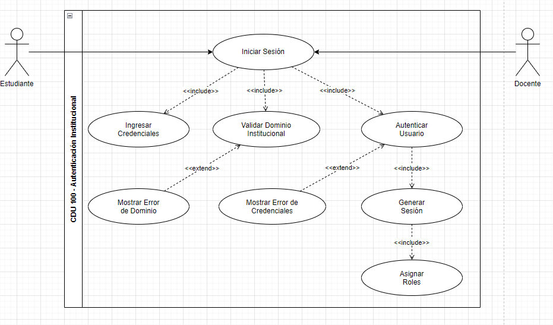
**Figura 3.** Caso de uso expandido de Autenticación Institucional.
## Flujo Principal

| Paso | Actor | Sistema |
|------|-------|----------|
| 1 | Accede al módulo de autenticación. | Muestra el formulario de inicio de sesión. |
| 2 | Ingresa correo institucional y contraseña. | Valida que la información haya sido ingresada. |
| 3 | Solicita iniciar sesión. | Verifica que el correo pertenezca al dominio institucional. |
| 4 | Espera la validación. | Autentica las credenciales del usuario. |
| 5 | Espera la respuesta. | Obtiene el rol y los permisos asignados al usuario. |
| 6 | — | Genera la sesión y el token de autenticación. |
| 7 | Accede al sistema. | Redirecciona al usuario a la página principal según su rol. |

## Flujos Alternativos

| Código | Paso | Descripción |
|---------|------|-------------|
| FA-01 | 3 | Si el usuario ya posee una sesión válida, el sistema reutiliza la sesión activa y redirecciona al panel principal. |
| FA-02 | 5 | Si el usuario posee más de un rol asignado, el sistema carga el conjunto de permisos correspondiente a todos los roles autorizados. |
| FA-03 | 7 | Dependiendo del rol (Administrador, Docente o Estudiante), el sistema muestra la interfaz correspondiente. |

## Flujos de Excepción

| Código | Paso | Descripción |
|---------|------|-------------|
| FE-01 | 2 | Si alguno de los campos obligatorios está vacío, el sistema solicita completar la información antes de continuar. |
| FE-02 | 3 | Si el correo electrónico no pertenece al dominio institucional autorizado, el sistema rechaza la autenticación e informa el motivo. |
| FE-03 | 4 | Si las credenciales son incorrectas, el sistema muestra un mensaje de autenticación fallida y permite un nuevo intento. |
| FE-04 | 4 | Si la cuenta se encuentra bloqueada o inactiva, el sistema impide el acceso e informa el estado de la cuenta. |
| FE-05 | 5 | Si ocurre un error al consultar la información del usuario o sus permisos, el sistema cancela el proceso y registra el incidente. |
| FE-06 | 6 | Si ocurre un error al generar la sesión o el token de autenticación, el sistema informa que no fue posible iniciar sesión y solicita intentarlo nuevamente. |

---
# Caso de Uso: Catálogo y Búsqueda Académica

## Diagrama de Caso de Uso

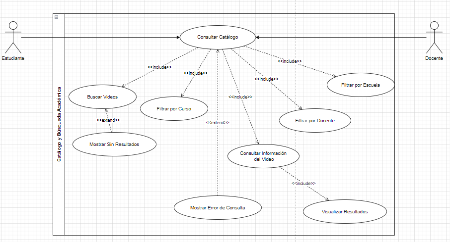

**Figura 4.** Caso de uso expandido de Catálogo y Búsqueda Académica.

## Flujo Principal

| Paso | Actor | Sistema |
|------|-------|----------|
| 1 | Accede al catálogo académico. | Muestra el catálogo disponible de contenido académico. |
| 2 | Ingresa un término de búsqueda o selecciona un criterio. | Recibe y procesa los criterios de búsqueda. |
| 3 | — | Busca los videos que coinciden con los criterios proporcionados. |
| 4 | — | Aplica los filtros seleccionados por curso, docente o escuela. |
| 5 | — | Obtiene la información asociada a los videos encontrados. |
| 6 | Consulta los resultados disponibles. | Muestra los resultados de la búsqueda con la información relevante de cada video. |
| 7 | Selecciona un video. | Muestra el detalle del contenido académico seleccionado. |

## Flujos Alternativos

| Código | Paso | Descripción |
|---------|------|-------------|
| FA-01 | 2 | El usuario puede realizar una búsqueda sin aplicar filtros adicionales. |
| FA-02 | 2 | El usuario puede consultar el catálogo directamente sin ingresar un término de búsqueda. |
| FA-03 | 4 | El usuario puede combinar varios filtros, como curso, docente y escuela, para reducir los resultados. |
| FA-04 | 6 | Si existen múltiples resultados, el sistema permite al usuario seleccionar cualquiera de ellos para consultar su información. |

## Flujos de Excepción

| Código | Paso | Descripción |
|---------|------|-------------|
| FE-01 | 2 | Si los criterios de búsqueda contienen información inválida, el sistema solicita corregirlos antes de realizar la consulta. |
| FE-02 | 3 | Si no existen videos que coincidan con los criterios proporcionados, el sistema informa que no se encontraron resultados. |
| FE-03 | 3 | Si ocurre un error durante la consulta del catálogo, el sistema informa que no fue posible obtener los resultados. |
| FE-04 | 4 | Si alguno de los filtros seleccionados no está disponible, el sistema ignora dicho filtro e informa al usuario. |
| FE-05 | 5 | Si la información de un video no está disponible, el sistema informa que no es posible consultar el detalle del contenido. |
| FE-06 | 7 | Si el video seleccionado ya no está disponible, el sistema informa al usuario y permite regresar a los resultados de búsqueda. |

---

# Caso de Uso: Reproducción de Clases

## Diagrama de Caso de Uso

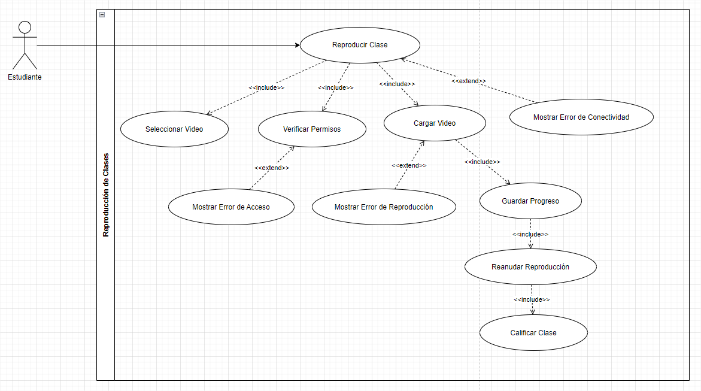

**Figura 5.** Caso de uso expandido de Reproducción de Clases.

## Flujo Principal

| Paso | Actor | Sistema |
|------|-------|----------|
| 1 | Selecciona una clase desde el catálogo académico. | Recibe la solicitud de reproducción del video seleccionado. |
| 2 | — | Verifica que el usuario tenga permisos para acceder al contenido. |
| 3 | — | Obtiene la información y ubicación del video. |
| 4 | — | Carga el video e inicia la reproducción. |
| 5 | Visualiza la clase. | Registra periódicamente el progreso de reproducción del usuario. |
| 6 | Continúa o pausa la reproducción. | Actualiza el punto de progreso de acuerdo con la interacción del usuario. |
| 7 | Finaliza o abandona la clase. | Guarda el último punto de reproducción alcanzado. |
| 8 | Selecciona una calificación. | Registra la calificación asociada al contenido académico. |

## Flujos Alternativos

| Código | Paso | Descripción |
|---------|------|-------------|
| FA-01 | 4 | Si existe un progreso previo para el video, el sistema ofrece reanudar la reproducción desde el último punto registrado. |
| FA-02 | 4 | El usuario puede iniciar la reproducción desde el comienzo del video, ignorando el progreso previamente registrado. |
| FA-03 | 5 | El usuario puede pausar, reanudar, adelantar o retroceder el video durante la reproducción. |
| FA-04 | 7 | Si el usuario abandona la reproducción antes de finalizarla, el sistema conserva el último punto de reproducción registrado. |
| FA-05 | 8 | El usuario puede omitir la calificación y finalizar la reproducción sin registrar una valoración. |

## Flujos de Excepción

| Código | Paso | Descripción |
|---------|------|-------------|
| FE-01 | 2 | Si el usuario no tiene permisos para acceder al contenido, el sistema rechaza la solicitud y muestra un mensaje de acceso no autorizado. |
| FE-02 | 3 | Si el video solicitado no existe o ya no está disponible, el sistema informa al usuario y cancela la reproducción. |
| FE-03 | 4 | Si ocurre un error al cargar el video, el sistema informa que no fue posible iniciar la reproducción y permite intentarlo nuevamente. |
| FE-04 | 5 | Si se pierde la conectividad durante la reproducción, el sistema pausa temporalmente el video e intenta recuperar la conexión. |
| FE-05 | 5 | Si no es posible recuperar la conexión, el sistema informa al usuario y conserva el último progreso registrado. |
| FE-06 | 7 | Si ocurre un error al guardar el progreso, el sistema continúa la reproducción, registra el incidente y permite intentar guardar el progreso posteriormente. |
| FE-07 | 8 | Si ocurre un error al registrar la calificación, el sistema informa al usuario sin interrumpir la reproducción o consulta del contenido. |

---
# Caso de Uso: Gestión de Asignaciones y Permisos

## Diagrama de Caso de Uso

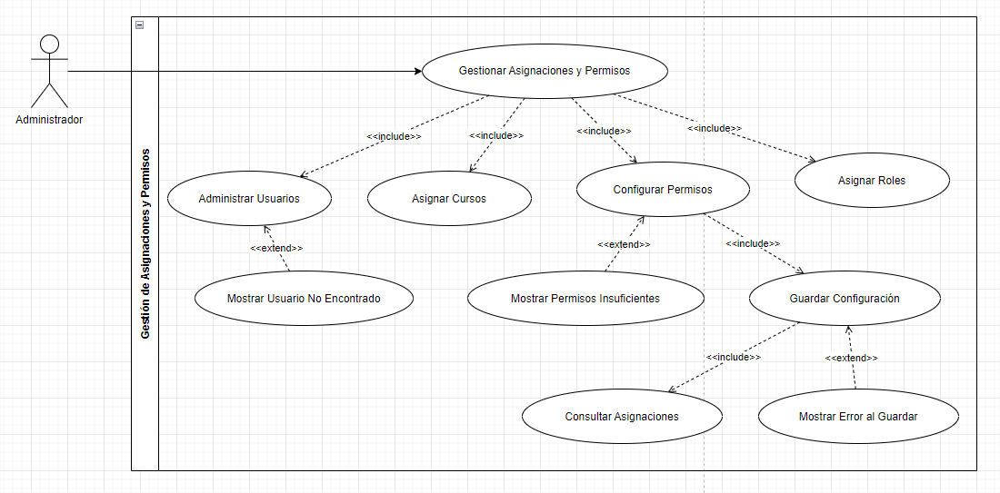

**Figura 6.** Caso de uso expandido de Gestión de Asignaciones y Permisos.

## Flujo Principal

| Paso | Actor | Sistema |
|------|-------|----------|
| 1 | Accede al módulo de gestión de asignaciones y permisos. | Verifica las credenciales y permisos del administrador. |
| 2 | Selecciona un usuario. | Muestra la información y asignaciones actuales del usuario. |
| 3 | Administra la información del usuario. | Valida los datos proporcionados. |
| 4 | Selecciona los cursos que desea asignar al usuario. | Valida que los cursos seleccionados estén disponibles. |
| 5 | Selecciona el rol que desea asignar. | Valida el rol y los permisos asociados. |
| 6 | Configura los permisos correspondientes. | Muestra los permisos disponibles de acuerdo con el rol seleccionado. |
| 7 | Confirma los cambios realizados. | Valida la configuración completa de asignaciones y permisos. |
| 8 | — | Guarda la configuración y actualiza las asignaciones y permisos del usuario. |
| 9 | — | Muestra la confirmación de la operación realizada. |

## Flujos Alternativos

| Código | Paso | Descripción |
|---------|------|-------------|
| FA-01 | 2 | El administrador puede consultar las asignaciones actuales de un usuario sin realizar modificaciones. |
| FA-02 | 3 | El administrador puede modificar únicamente la información del usuario sin cambiar sus cursos o permisos. |
| FA-03 | 4 | El administrador puede asignar varios cursos al mismo usuario durante una única operación. |
| FA-04 | 5 | El administrador puede asignar diferentes roles de acuerdo con las responsabilidades del usuario. |
| FA-05 | 6 | El administrador puede modificar permisos específicos cuando la configuración del rol lo permita. |
| FA-06 | 7 | El administrador puede cancelar la operación antes de guardar los cambios, manteniendo la configuración anterior. |

## Flujos de Excepción

| Código | Paso | Descripción |
|---------|------|-------------|
| FE-01 | 1 | Si el usuario que intenta acceder no posee permisos de administrador, el sistema rechaza el acceso al módulo. |
| FE-02 | 2 | Si el usuario seleccionado no existe, el sistema informa que no se encontró el usuario y permite realizar una nueva búsqueda. |
| FE-03 | 3 | Si los datos del usuario son inválidos o incompletos, el sistema solicita corregirlos antes de continuar. |
| FE-04 | 4 | Si alguno de los cursos seleccionados no está disponible, el sistema informa la situación y solicita seleccionar otro curso. |
| FE-05 | 5 | Si el rol seleccionado no puede ser asignado al usuario, el sistema rechaza la operación e informa el motivo. |
| FE-06 | 6 | Si el administrador intenta asignar permisos incompatibles con el rol seleccionado, el sistema rechaza la configuración. |
| FE-07 | 8 | Si ocurre un error al guardar la configuración, el sistema informa que la operación no pudo completarse y conserva la configuración anterior. |
| FE-08 | 8 | Si ocurre un error de comunicación con el servicio encargado de gestionar usuarios, cursos o permisos, el sistema cancela la operación y registra el incidente. |

---
# Vista de Escenarios

## Descripción

La Vista de Escenarios representa los principales casos de uso de la plataforma y permite relacionar los actores externos con las funcionalidades principales del sistema.

Esta vista constituye el punto de partida del modelo arquitectónico 4+1 de Kruchten, ya que permite identificar las interacciones que posteriormente serán soportadas por las vistas lógica, de procesos, de desarrollo y de despliegue.

## Diagrama de la vista de escenarios.
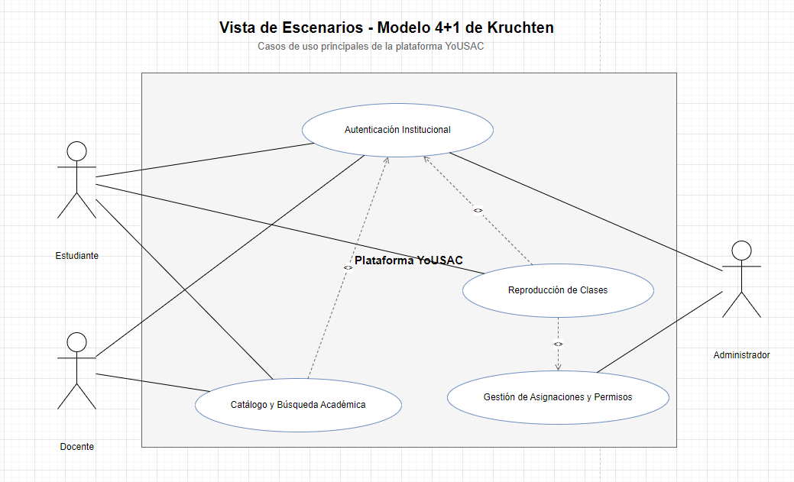
**Figura 7.** Vista de escenarios.

## Actores

| Actor | Descripción |
|---|---|
| Estudiante | Usuario que accede a la plataforma para consultar contenido académico, reproducir clases y gestionar su progreso. |
| Docente | Usuario responsable de gestionar y consultar contenido académico asociado a sus actividades. |
| Administrador | Usuario encargado de administrar usuarios, roles, permisos y recursos de la plataforma. |
| Sistema de Identidad Institucional | Servicio externo encargado de validar la identidad de los usuarios mediante las credenciales institucionales. |

## Casos de uso principales

| Código | Caso de uso | Descripción | Actor principal |
|---|---|---|---|
| CU-01 | Autenticación Institucional | Permite al usuario ingresar a la plataforma utilizando sus credenciales institucionales. | Estudiante / Docente / Administrador |
| CU-02 | Catálogo y Búsqueda Académica | Permite consultar, explorar y buscar clases y recursos académicos disponibles. | Estudiante / Docente |
| CU-03 | Reproducción de Clases | Permite reproducir las clases disponibles y acceder al contenido multimedia. | Estudiante / Docente |
| CU-04 | Gestión de Asignaciones y Permisos | Permite administrar usuarios, roles, permisos y asignaciones de acceso. | Administrador |
| CU-05 | Gestión de Progreso | Permite registrar y consultar el avance del usuario durante la reproducción de las clases. | Estudiante |
| CU-06 | Calificación y Valoración | Permite registrar valoraciones sobre el contenido académico consumido. | Estudiante |

## Relaciones principales

| Origen | Relación | Destino |
|---|---|---|
| Usuario | solicita autenticación | Autenticación Institucional |
| Autenticación Institucional | valida identidad | Sistema de Identidad Institucional |
| Usuario autenticado | consulta | Catálogo y Búsqueda Académica |
| Catálogo y Búsqueda Académica | proporciona acceso a | Reproducción de Clases |
| Reproducción de Clases | registra | Gestión de Progreso |
| Usuario | realiza | Calificación y Valoración |
| Administrador | administra | Gestión de Asignaciones y Permisos |

## Flujo general de escenarios

1. El usuario accede a la plataforma.
2. El sistema solicita la autenticación institucional.
3. Las credenciales son validadas mediante el sistema de identidad institucional.
4. El sistema determina los roles y permisos asociados al usuario.
5. El usuario accede al catálogo académico según sus permisos.
6. El usuario realiza una búsqueda o selecciona una clase.
7. El sistema permite la reproducción del contenido autorizado.
8. Durante la reproducción se registra el progreso del usuario.
9. El usuario puede valorar el contenido académico.
10. El administrador puede gestionar usuarios, roles y permisos.

## Trazabilidad con las demás vistas

La Vista de Escenarios sirve como base para las demás vistas arquitectónicas:

| Vista | Relación con los escenarios |
|---|---|
| Vista Lógica | Identifica las responsabilidades y módulos que implementan los casos de uso. |
| Vista de Procesos | Define la interacción y comunicación entre los procesos que ejecutan los casos de uso. |
| Vista de Desarrollo / Componentes | Identifica los componentes de software responsables de implementar las funcionalidades. |
| Vista de Despliegue | Define dónde se ejecutan físicamente los componentes identificados. |

## Objetivo arquitectónico

La Vista de Escenarios permite asegurar que la arquitectura propuesta mantenga trazabilidad entre las necesidades del negocio y los elementos técnicos que conforman la plataforma.

Los escenarios principales de la plataforma son:

**Autenticación → Catálogo → Reproducción → Progreso/Valoración**

mientras que la administración transversal se concentra en:

**Usuarios → Roles → Permisos → Asignaciones**

# Vista Lógica

## Descripción

La Vista Lógica representa la organización interna de la plataforma desde una perspectiva funcional y estructural. Su objetivo es identificar las principales responsabilidades del sistema y las relaciones existentes entre ellas.

Esta vista permite establecer una correspondencia entre los casos de uso definidos en la Vista de Escenarios y los módulos lógicos que proporcionan la funcionalidad necesaria para ejecutarlos.

La arquitectura lógica de la plataforma se organiza en las siguientes responsabilidades principales:

- Autenticación y Seguridad.
- Gestión de Usuarios, Roles y Permisos.
- Catálogo Académico.
- Gestión de Contenido Académico.
- Reproducción de Clases.
- Gestión de Progreso.
- Calificación y Valoración.

## Diagrama de Vista Lógica

**Figura 8. Vista lógica de la arquitectura**

## Componentes lógicos

| Componente lógico | Responsabilidad |
|---|---|
| Autenticación y Seguridad | Gestionar la identificación y autenticación de los usuarios mediante las credenciales institucionales. |
| Gestión de Usuarios, Roles y Permisos | Administrar usuarios, roles, permisos y las reglas de acceso a las funcionalidades de la plataforma. |
| Catálogo Académico | Permitir la consulta, exploración y búsqueda de las clases y recursos académicos disponibles. |
| Gestión de Contenido Académico | Administrar y proporcionar la información y recursos asociados al contenido académico. |
| Reproducción de Clases | Gestionar el acceso y reproducción de las clases disponibles para el usuario. |
| Gestión de Progreso | Registrar y recuperar el avance del usuario durante la reproducción de las clases. |
| Calificación y Valoración | Gestionar las calificaciones y valoraciones realizadas por los usuarios sobre el contenido académico. |

## Relaciones entre componentes

| Componente origen | Relación | Componente destino |
|---|---|---|
| Autenticación y Seguridad | Autoriza el acceso | Gestión de Usuarios, Roles y Permisos |
| Autenticación y Seguridad | Permite el acceso autenticado | Catálogo Académico |
| Gestión de Usuarios, Roles y Permisos | Controla los permisos de consulta | Catálogo Académico |
| Gestión de Usuarios, Roles y Permisos | Controla el acceso | Gestión de Contenido Académico |
| Catálogo Académico | Consulta | Gestión de Contenido Académico |
| Catálogo Académico | Selecciona clases | Reproducción de Clases |
| Gestión de Contenido Académico | Proporciona contenido | Reproducción de Clases |
| Gestión de Usuarios, Roles y Permisos | Autoriza la reproducción | Reproducción de Clases |
| Reproducción de Clases | Registra el avance | Gestión de Progreso |
| Gestión de Progreso | Permite recuperar el avance | Reproducción de Clases |
| Reproducción de Clases | Solicita valoración | Calificación y Valoración |

## Flujo lógico principal

El funcionamiento lógico de la plataforma comienza con la autenticación del usuario. Una vez validada su identidad, el sistema determina los permisos correspondientes y permite el acceso a las funcionalidades autorizadas.

El usuario puede posteriormente consultar el catálogo académico y seleccionar el contenido que desea reproducir. El módulo de reproducción obtiene el contenido correspondiente y registra el progreso durante el consumo de la clase.

Finalmente, el usuario puede realizar una valoración del contenido académico consumido.

El flujo general puede representarse como:

**Autenticación → Autorización → Catálogo → Contenido → Reproducción → Progreso → Valoración**

## Separación de responsabilidades

La Vista Lógica mantiene separadas las principales responsabilidades del sistema para reducir el acoplamiento y favorecer la cohesión de cada módulo.

La autenticación se mantiene separada de la autorización, debido a que la primera determina la identidad del usuario, mientras que la segunda determina las acciones que dicho usuario tiene permitido realizar.

De igual manera, el catálogo académico se mantiene separado de la gestión del contenido, permitiendo diferenciar la consulta y descubrimiento de recursos de la administración y provisión de dichos recursos.

La reproducción también se mantiene como una responsabilidad independiente, ya que requiere gestionar aspectos específicos de la experiencia de consumo del contenido, incluyendo el registro y recuperación del progreso.

## Relación con la arquitectura 4+1

La Vista Lógica constituye el vínculo entre los escenarios funcionales y las estructuras de software que posteriormente serán implementadas.

| Elemento | Relación |
|---|---|
| Vista de Escenarios | Define las funcionalidades que debe soportar el sistema. |
| Vista Lógica | Define las responsabilidades necesarias para soportar dichas funcionalidades. |
| Vista de Procesos | Define cómo interactúan los procesos que ejecutan dichas responsabilidades. |
| Vista de Desarrollo / Componentes | Define los componentes de software que implementan las responsabilidades lógicas. |
| Vista de Despliegue | Define la distribución física de dichos componentes en la infraestructura. |

## Objetivo arquitectónico

La Vista Lógica busca proporcionar una estructura modular, cohesionada y con bajo acoplamiento, permitiendo que las principales funcionalidades de la plataforma puedan evolucionar de manera independiente y sirviendo como base para la posterior definición de componentes y servicios.

# Vista de Procesos (gRPC)

## Descripción

La Vista de Procesos representa el comportamiento dinámico de la plataforma y muestra cómo interactúan los diferentes procesos y servicios durante la ejecución de las funcionalidades principales.

Esta vista se enfoca en la comunicación entre los componentes de la arquitectura, utilizando **gRPC sobre HTTP/2** como mecanismo principal de comunicación síncrona entre los servicios internos.

El objetivo es representar cómo una solicitud iniciada por el usuario atraviesa los diferentes procesos de la plataforma y cómo estos colaboran para completar una operación.

## Diagrama de Procesos gRPC

**Figura 9. Vista de procesos mediante comunicación gRPC**

## Procesos principales

| Proceso / Servicio | Responsabilidad |
|---|---|
| Cliente Web / Aplicación | Iniciar las solicitudes de los usuarios y presentar las respuestas obtenidas de la plataforma. |
| API Gateway / BFF | Recibir las solicitudes del cliente, aplicar las reglas de entrada y dirigirlas hacia los servicios correspondientes. |
| AuthService | Validar la identidad del usuario mediante el mecanismo de autenticación institucional. |
| UserAccessService | Consultar y validar los roles y permisos asociados al usuario. |
| CatalogService | Ejecutar consultas y búsquedas sobre el catálogo académico. |
| ContentService | Proporcionar la información y los recursos correspondientes al contenido académico solicitado. |
| PlaybackService | Gestionar el inicio y control de la reproducción de las clases. |
| ProgressService | Registrar y recuperar el progreso del usuario durante la reproducción. |
| RatingService | Registrar las calificaciones y valoraciones realizadas sobre el contenido académico. |

## Comunicación entre procesos

La comunicación entre los servicios internos se realiza mediante **gRPC**, utilizando contratos definidos mediante interfaces de servicio.

| Proceso origen | Operación gRPC | Proceso destino |
|---|---|---|
| API Gateway / BFF | `Authenticate()` | AuthService |
| API Gateway / BFF | `GetUserPermissions()` | UserAccessService |
| API Gateway / BFF | `SearchCatalog()` | CatalogService |
| API Gateway / BFF | `StartPlayback()` | PlaybackService |
| AuthService | `ValidateUser()` | UserAccessService |
| PlaybackService | `CheckPermission()` | UserAccessService |
| CatalogService | `GetContent()` | ContentService |
| PlaybackService | `GetPlaybackResource()` | ContentService |
| PlaybackService | `GetProgress()` | ProgressService |
| PlaybackService | `SaveProgress()` | ProgressService |
| PlaybackService | `SubmitRating()` | RatingService |

## Flujo general de procesamiento

El procesamiento de una solicitud comienza en el cliente, que se comunica con el API Gateway mediante HTTPS.

El Gateway determina el servicio responsable de procesar la operación y realiza una llamada gRPC hacia el servicio correspondiente.

Dependiendo de la operación solicitada, el servicio puede requerir la colaboración de otros servicios internos antes de generar la respuesta.

El flujo general puede representarse como:

**Cliente → API Gateway → Servicio correspondiente → Servicios dependientes → Respuesta**

## Flujo de autenticación

Para una operación de autenticación, el flujo de procesos es:

1. El usuario introduce sus credenciales institucionales.
2. El cliente envía la solicitud al API Gateway.
3. El Gateway invoca `Authenticate()` mediante gRPC.
4. `AuthService` procesa la solicitud de autenticación.
5. `AuthService` solicita la validación del usuario mediante `ValidateUser()`.
6. `UserAccessService` consulta la información correspondiente.
7. Se determina la identidad y los permisos del usuario.
8. La respuesta retorna hacia `AuthService`.
9. `AuthService` responde al API Gateway.
10. El Gateway devuelve el resultado al cliente.

## Flujo de búsqueda y reproducción

Para la consulta y reproducción de una clase, el procesamiento se realiza de la siguiente manera:

1. El usuario realiza una búsqueda desde la aplicación.
2. El cliente envía la solicitud al API Gateway.
3. El Gateway invoca `SearchCatalog()` sobre `CatalogService`.
4. `CatalogService` consulta el contenido disponible.
5. El usuario selecciona una clase.
6. El Gateway solicita `StartPlayback()` a `PlaybackService`.
7. `PlaybackService` valida los permisos mediante `CheckPermission()`.
8. `PlaybackService` solicita el recurso mediante `GetPlaybackResource()`.
9. `ContentService` proporciona la información necesaria para la reproducción.
10. `PlaybackService` consulta el avance existente mediante `GetProgress()`.
11. `ProgressService` devuelve el progreso registrado.
12. La información necesaria para iniciar la reproducción retorna al cliente.

## Flujo durante la reproducción

Mientras el usuario reproduce una clase, `PlaybackService` mantiene la coordinación del proceso de reproducción.

El progreso del usuario puede ser enviado periódicamente a `ProgressService` mediante `SaveProgress()`.

De esta manera, el sistema puede conservar información como:

- Posición actual de reproducción.
- Porcentaje de avance.
- Estado de la reproducción.
- Último punto registrado.

El proceso puede representarse como:

**PlaybackService → ProgressService → Persistencia del progreso**

## Flujo de valoración

Una vez que el usuario consume el contenido, puede realizar una valoración.

El flujo correspondiente es:

**Cliente → API Gateway → PlaybackService → RatingService**

`PlaybackService` coordina la operación y `RatingService` se encarga de registrar la valoración correspondiente.

## Características de la comunicación gRPC

La comunicación interna basada en gRPC proporciona las siguientes características:

| Característica | Aplicación en la arquitectura |
|---|---|
| Comunicación síncrona | Permite solicitar una operación y esperar su respuesta inmediata. |
| HTTP/2 | Proporciona el transporte utilizado por gRPC. |
| Contratos definidos | Las operaciones de los servicios se establecen mediante interfaces formales. |
| Serialización eficiente | Los mensajes pueden ser serializados mediante Protocol Buffers. |
| Tipado fuerte | Las solicitudes y respuestas tienen estructuras definidas. |
| Interoperabilidad | Los servicios pueden implementarse utilizando diferentes lenguajes de programación. |
| Bajo acoplamiento | Los servicios interactúan mediante contratos en lugar de acceder directamente a la implementación interna de otros servicios. |

## Manejo de errores

Los servicios deben devolver respuestas controladas ante errores de procesamiento.

Entre los principales escenarios se contemplan:

| Escenario | Comportamiento |
|---|---|
| Usuario no autenticado | Se rechaza la operación y se solicita autenticación. |
| Usuario sin permisos | El servicio rechaza la operación por falta de autorización. |
| Servicio no disponible | El consumidor recibe un error controlado y puede aplicar mecanismos de reintento cuando corresponda. |
| Recurso inexistente | Se devuelve una respuesta indicando que el contenido solicitado no existe. |
| Error de persistencia | El servicio informa el fallo sin exponer detalles internos de infraestructura. |
| Tiempo de espera excedido | Se cancela la operación y se devuelve un error controlado. |

## Consideraciones de concurrencia

La arquitectura debe permitir que múltiples usuarios realicen operaciones simultáneamente.

Por esta razón, los servicios gRPC deben diseñarse como procesos independientes y preferentemente sin estado de sesión local, permitiendo distribuir las solicitudes entre múltiples instancias.

La información persistente del usuario, como permisos, progreso y valoraciones, debe mantenerse en los mecanismos de persistencia correspondientes.

## Relación con las demás vistas

La Vista de Procesos complementa las demás vistas del modelo 4+1 de Kruchten:

| Vista | Relación |
|---|---|
| Vista de Escenarios | Define las operaciones que deben ser ejecutadas. |
| Vista Lógica | Define las responsabilidades funcionales involucradas. |
| Vista de Procesos | Define cómo interactúan dichas responsabilidades durante la ejecución. |
| Vista de Componentes | Define los componentes que implementan los procesos. |
| Vista de Despliegue | Define dónde se ejecutan físicamente los procesos y servicios. |

## Objetivo arquitectónico

La Vista de Procesos busca garantizar una comunicación estructurada entre los servicios de la plataforma, manteniendo responsabilidades claramente delimitadas y utilizando contratos gRPC para establecer las interacciones internas.

El flujo principal de procesamiento se resume en:

**Cliente → API Gateway → gRPC → Servicios → Persistencia / Contenido → Respuesta**

Esta organización permite distribuir las cargas de trabajo, escalar los servicios de manera independiente y mantener un bajo acoplamiento entre los diferentes dominios funcionales de la plataforma.

# Vista de Componentes

## Descripción

La Vista de Componentes representa la organización del software en componentes desplegables y sus relaciones de dependencia.

Esta vista transforma las responsabilidades identificadas en la Vista Lógica en componentes de software con responsabilidades claramente delimitadas. También define las principales interfaces de comunicación entre ellos.

La arquitectura propuesta utiliza un enfoque orientado a servicios, donde los componentes internos se comunican principalmente mediante **gRPC sobre HTTP/2**, mientras que la aplicación cliente se comunica con el sistema mediante **HTTPS/REST**.

## Diagrama de Componentes

**Figura 10. Diagrama de componentes de la arquitectura**

## Componentes principales

| Código | Componente | Responsabilidad |
|---|---|---|
| CMP-01 | Aplicación Web | Proporcionar la interfaz de usuario y permitir la interacción con las funcionalidades de la plataforma. |
| CMP-02 | API Gateway / BFF | Centralizar las solicitudes provenientes del cliente y dirigirlas hacia los servicios correspondientes. |
| CMP-03 | Authentication Service | Gestionar la autenticación de los usuarios mediante las credenciales institucionales. |
| CMP-04 | Access Management Service | Gestionar usuarios, roles, permisos y autorización de operaciones. |
| CMP-05 | Academic Catalog Service | Gestionar la consulta y búsqueda del catálogo académico. |
| CMP-06 | Academic Content Service | Gestionar la información y los recursos asociados al contenido académico. |
| CMP-07 | Playback Service | Gestionar la reproducción de las clases y coordinar los servicios requeridos durante el consumo. |
| CMP-08 | Progress Service | Registrar y consultar el progreso de los usuarios durante la reproducción. |
| CMP-09 | Rating Service | Registrar y gestionar las valoraciones realizadas por los usuarios. |

## Interfaces de comunicación

| Componente origen | Interfaz / protocolo | Componente destino | Propósito |
|---|---|---|---|
| Aplicación Web | HTTPS / REST | API Gateway / BFF | Solicitar las operaciones de la plataforma. |
| API Gateway / BFF | gRPC | Authentication Service | Ejecutar operaciones de autenticación. |
| API Gateway / BFF | gRPC | Access Management Service | Consultar permisos y autorización. |
| API Gateway / BFF | gRPC | Academic Catalog Service | Ejecutar búsquedas y consultas académicas. |
| API Gateway / BFF | gRPC | Playback Service | Solicitar el inicio y gestión de reproducción. |
| Authentication Service | gRPC | Access Management Service | Validar información relacionada con el usuario. |
| Access Management Service | gRPC | Academic Catalog Service | Aplicar restricciones de acceso al catálogo. |
| Academic Catalog Service | gRPC | Academic Content Service | Obtener información relacionada con el contenido. |
| Playback Service | gRPC | Access Management Service | Validar permisos para reproducir contenido. |
| Playback Service | gRPC | Academic Content Service | Obtener los recursos necesarios para la reproducción. |
| Playback Service | gRPC | Progress Service | Consultar y registrar el progreso del usuario. |
| Playback Service | gRPC | Rating Service | Registrar las valoraciones asociadas al contenido. |

## Componentes de persistencia

La arquitectura contempla mecanismos de persistencia separados de acuerdo con los principales dominios funcionales.

| Persistencia | Información principal |
|---|---|
| Identity DB | Información relacionada con identidad y acceso. |
| Academic DB | Información del catálogo y contenido académico. |
| Playback DB | Información relacionada con progreso e historial de reproducción. |
| Rating DB | Valoraciones y calificaciones realizadas por los usuarios. |

Esta separación permite reducir el acoplamiento entre dominios y facilita la evolución independiente de cada componente.

## Dependencias entre componentes

Las principales dependencias se establecen de la siguiente manera:

**Aplicación Web → API Gateway → Servicios de dominio → Persistencia**

Los servicios no deben acceder directamente a la base de datos perteneciente a otro servicio. Cuando necesitan información de otro dominio, deben utilizar la interfaz definida para dicho servicio.

Por ejemplo, `Playback Service` no consulta directamente la información de usuarios en `Identity DB`. En su lugar, solicita la validación correspondiente mediante `Access Management Service`.

## API Gateway / BFF

El API Gateway funciona como punto de entrada para las solicitudes provenientes de la aplicación cliente.

Sus principales responsabilidades son:

- Recibir solicitudes externas.
- Validar parámetros de entrada.
- Gestionar la comunicación con los servicios internos.
- Aplicar políticas generales de acceso.
- Encapsular la estructura interna de los servicios frente al cliente.
- Transformar las respuestas internas al formato esperado por la aplicación.

El Gateway evita que el cliente tenga que conocer directamente la ubicación o estructura interna de cada servicio.

## Comunicación mediante gRPC

Los servicios internos utilizan **gRPC** como mecanismo de comunicación.

Las interfaces gRPC establecen contratos explícitos para las operaciones disponibles entre componentes. Esto permite mantener una comunicación fuertemente tipada y desacoplada de la implementación interna de cada servicio.

Entre las operaciones principales se encuentran:

- `Authenticate()`
- `ValidateUser()`
- `GetUserPermissions()`
- `SearchCatalog()`
- `GetContent()`
- `StartPlayback()`
- `GetPlaybackResource()`
- `CheckPermission()`
- `GetProgress()`
- `SaveProgress()`
- `SubmitRating()`

## Principio de separación de responsabilidades

Cada componente debe concentrarse en una responsabilidad funcional específica.

Por ejemplo:

- **Authentication Service** determina la identidad del usuario.
- **Access Management Service** determina qué acciones puede realizar.
- **Academic Catalog Service** permite localizar contenido académico.
- **Academic Content Service** proporciona la información del contenido.
- **Playback Service** coordina la reproducción.
- **Progress Service** administra el avance del usuario.
- **Rating Service** administra las valoraciones.

Esta separación favorece la cohesión y disminuye el acoplamiento entre los componentes.

## Trazabilidad con los casos de uso

| Caso de uso | Componentes involucrados |
|---|---|
| Autenticación Institucional | Aplicación Web, API Gateway, Authentication Service, Access Management Service |
| Catálogo y Búsqueda Académica | Aplicación Web, API Gateway, Access Management Service, Academic Catalog Service, Academic Content Service |
| Reproducción de Clases | Aplicación Web, API Gateway, Playback Service, Access Management Service, Academic Content Service, Progress Service |
| Gestión de Asignaciones y Permisos | Aplicación Web, API Gateway, Access Management Service |
| Gestión de Progreso | Playback Service, Progress Service |
| Calificación y Valoración | Aplicación Web, API Gateway, Playback Service, Rating Service |

## Relación con las demás vistas

La Vista de Componentes conecta las responsabilidades lógicas con los elementos concretos que serán desarrollados y desplegados.

| Vista | Relación |
|---|---|
| Vista de Escenarios | Define las funcionalidades que deben ser soportadas. |
| Vista Lógica | Define las responsabilidades funcionales del sistema. |
| Vista de Procesos | Define la interacción dinámica entre los servicios. |
| Vista de Componentes | Define los componentes de software que implementan dichas responsabilidades. |
| Vista de Despliegue | Define dónde se ejecutan físicamente los componentes. |

## Objetivo arquitectónico

La Vista de Componentes busca establecer una estructura modular que permita desarrollar, probar, desplegar y escalar los principales dominios funcionales de manera independiente.

La estructura general se resume en:

**Aplicación Web → API Gateway → Servicios especializados → Persistencia**

La comunicación entre los servicios se realiza mediante contratos **gRPC**, evitando dependencias directas entre las implementaciones internas y favoreciendo la evolución independiente de los componentes.

# Vista de Despliegue

## Descripción

La Vista de Despliegue representa la distribución física de los componentes de software sobre la infraestructura tecnológica necesaria para ejecutar la plataforma.

Esta vista permite identificar los nodos de ejecución, servidores, mecanismos de comunicación, bases de datos y almacenamiento de contenido que participan en la operación de la plataforma.

La arquitectura propuesta separa la capa de presentación, la capa de servicios y la capa de persistencia, permitiendo escalar cada nivel de manera independiente.

## Diagrama de Despliegue

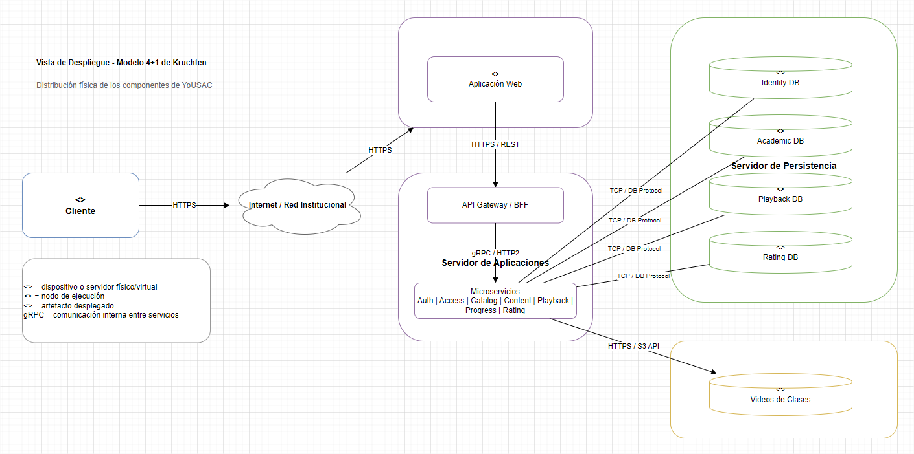

**Figura 11. Diagrama de despliegue de la arquitectura**

## Nodos de despliegue

| Código | Nodo | Responsabilidad |
|---|---|---|
| ND-01 | Cliente | Dispositivo utilizado por estudiantes, docentes y administradores para acceder a la plataforma. |
| ND-02 | Internet / Red Institucional | Medio de comunicación entre los clientes y la infraestructura de la plataforma. |
| ND-03 | Servidor Web / Frontend | Alojar y proporcionar la aplicación web al usuario final. |
| ND-04 | Servidor de Aplicaciones | Ejecutar el API Gateway y los servicios principales de la plataforma. |
| ND-05 | Servidor de Persistencia | Proporcionar los mecanismos de almacenamiento de información transaccional. |
| ND-06 | Almacenamiento de Contenido | Almacenar los archivos multimedia correspondientes a las clases académicas. |

## Artefactos desplegados

| Nodo | Artefacto | Descripción |
|---|---|---|
| Servidor Web / Frontend | Aplicación Web | Interfaz mediante la cual los usuarios interactúan con la plataforma. |
| Servidor de Aplicaciones | API Gateway / BFF | Punto de entrada para las solicitudes provenientes de la aplicación web. |
| Servidor de Aplicaciones | Authentication Service | Servicio encargado de la autenticación de usuarios. |
| Servidor de Aplicaciones | Access Management Service | Servicio encargado de usuarios, roles y permisos. |
| Servidor de Aplicaciones | Academic Catalog Service | Servicio encargado de búsquedas y consultas del catálogo. |
| Servidor de Aplicaciones | Academic Content Service | Servicio encargado de proporcionar información y recursos académicos. |
| Servidor de Aplicaciones | Playback Service | Servicio encargado de coordinar la reproducción de clases. |
| Servidor de Aplicaciones | Progress Service | Servicio encargado de gestionar el progreso del usuario. |
| Servidor de Aplicaciones | Rating Service | Servicio encargado de gestionar las valoraciones. |

## Persistencia

La información transaccional se distribuye en diferentes mecanismos de almacenamiento lógico.

| Base de datos | Información almacenada |
|---|---|
| Identity DB | Identidad, usuarios y datos relacionados con autenticación y acceso. |
| Academic DB | Catálogo, clases y metadatos del contenido académico. |
| Playback DB | Progreso e historial de reproducción. |
| Rating DB | Calificaciones y valoraciones de los usuarios. |

La separación lógica de estas bases de datos permite mantener los límites de los dominios y reducir el acoplamiento entre los servicios.

## Almacenamiento de contenido multimedia

Los videos y recursos multimedia de las clases se almacenan en un mecanismo especializado de almacenamiento de objetos.

Este almacenamiento se mantiene separado de las bases de datos transaccionales debido a las características propias de los archivos multimedia, tales como:

- Alto volumen de almacenamiento.
- Archivos de gran tamaño.
- Necesidad de transferencia eficiente.
- Posibilidad de crecimiento continuo.
- Necesidad de distribución y escalabilidad independiente.

El `Academic Content Service` mantiene la información necesaria para localizar los recursos, mientras que el almacenamiento de contenido conserva los archivos multimedia.

## Comunicación entre nodos

| Origen | Destino | Protocolo | Propósito |
|---|---|---|---|
| Cliente | Internet / Red Institucional | HTTPS | Acceso seguro a la plataforma. |
| Internet / Red Institucional | Servidor Web | HTTPS | Solicitar la aplicación web. |
| Aplicación Web | API Gateway / BFF | HTTPS / REST | Ejecutar operaciones de la plataforma. |
| API Gateway | Servicios internos | gRPC / HTTP/2 | Comunicación entre los servicios. |
| Servicios | Bases de datos | Protocolo nativo de BD | Persistencia de información. |
| Servicios | Almacenamiento de Contenido | HTTPS / API de almacenamiento | Acceso a los recursos multimedia. |

## Flujo de despliegue

El flujo general de una solicitud es:

**Cliente → Internet / Red Institucional → Servidor Web → API Gateway → Servicios → Persistencia / Contenido**

Cuando el usuario solicita una operación, la aplicación web transmite la solicitud al API Gateway.

El Gateway dirige la operación hacia el servicio correspondiente mediante gRPC. El servicio puede consultar otros servicios internos y acceder a los mecanismos de persistencia necesarios para completar la operación.

Una vez finalizado el procesamiento, la respuesta retorna por la misma cadena hasta llegar al cliente.

## Escalabilidad

La distribución propuesta permite escalar horizontalmente los principales componentes de la plataforma.

El servidor de aplicaciones puede contar con múltiples instancias de los servicios, distribuyendo las solicitudes entre ellas mediante un mecanismo de balanceo de carga.

---
# Modelo de Datos — Diagrama Entidad-Relación (ERD)

## Descripción

El modelo de datos define la estructura de información persistente utilizada por la plataforma para soportar sus principales funcionalidades.

El Diagrama Entidad-Relación (ERD) representa las entidades, atributos, claves primarias, claves foráneas y relaciones necesarias para implementar los dominios de identidad y acceso, gestión académica, reproducción, progreso y valoración.

Además, el modelo incorpora objetos programables de base de datos, tales como Stored Procedures, Views, Functions y Triggers, destinados a encapsular operaciones, consultas, cálculos y reglas automáticas.

## Diagrama Entidad-Relación

**Figura 12. Diagrama Entidad-Relación y objetos programables de base de datos**

## Dominios de información

El modelo de datos se organiza en cuatro dominios principales:

| Dominio | Propósito | Entidades principales |
|---|---|---|
| Identidad y Acceso | Gestionar usuarios, roles y permisos. | `USUARIO`, `ROL`, `PERMISO`, `USUARIO_ROL`, `ROL_PERMISO` |
| Académico | Gestionar la estructura y los recursos académicos. | `CATEGORIA`, `CURSO`, `CLASE`, `RECURSO` |
| Reproducción | Registrar el consumo y avance de las clases. | `REPRODUCCION`, `PROGRESO` |
| Valoración | Registrar la evaluación realizada por los usuarios. | `VALORACION` |

## Entidades principales

### USUARIO

Representa a las personas que utilizan la plataforma.

Sus principales atributos son:

- `id_usuario`: identificador único del usuario.
- `codigo_institucional`: identificador institucional.
- `nombre`: nombre del usuario.
- `correo`: correo electrónico.
- `estado`: estado de la cuenta.
- `fecha_creacion`: fecha de creación.
- `fecha_actualizacion`: fecha de última modificación.

### ROL

Representa los roles que pueden ser asignados a los usuarios.

Un usuario puede tener uno o varios roles dependiendo de las reglas de autorización definidas por la plataforma.

### PERMISO

Representa las acciones específicas que pueden ejecutarse sobre los recursos del sistema.

Los permisos se relacionan con los roles mediante la entidad `ROL_PERMISO`.

### USUARIO_ROL

Entidad asociativa que relaciona usuarios con roles.

Permite implementar una relación muchos a muchos entre `USUARIO` y `ROL`.

Sus principales claves foráneas son:

- `id_usuario`
- `id_rol`

También permite registrar información relacionada con la asignación, como fecha y estado.

### ROL_PERMISO

Entidad asociativa que relaciona los roles con los permisos disponibles.

Permite implementar el modelo de autorización basado en roles.

## Modelo académico

### CATEGORIA

Representa una clasificación lógica del contenido académico.

Una categoría puede contener múltiples cursos.

### CURSO

Representa una unidad académica dentro del catálogo.

Cada curso pertenece a una categoría y puede contener múltiples clases.

### CLASE

Representa una clase académica disponible para reproducción.

Cada clase pertenece a un curso y puede disponer de uno o varios recursos asociados.

Entre sus principales atributos se encuentran:

- `id_clase`
- `id_curso`
- `titulo`
- `descripcion`
- `duracion`
- `estado`
- `fecha_publicacion`

### RECURSO

Representa un recurso asociado a una clase.

Puede utilizarse para almacenar información relacionada con archivos multimedia, documentos u otros recursos utilizados durante una clase.

El archivo físico no necesariamente se almacena directamente en la base de datos. El modelo puede conservar una referencia mediante atributos como `url` o `nombre_archivo`.

## Modelo de reproducción

### REPRODUCCION

Registra las sesiones o eventos de reproducción realizados por los usuarios.

Permite establecer la relación entre el usuario que reproduce el contenido y la clase académica reproducida.

Puede almacenar información como:

- Usuario que inició la reproducción.
- Clase reproducida.
- Fecha de inicio.
- Fecha de finalización.
- Estado de la reproducción.

### PROGRESO

Representa el avance de un usuario dentro de una clase.

Permite conservar información como:

- Usuario.
- Clase.
- Segundo actual de reproducción.
- Porcentaje de avance.
- Fecha de actualización.

Esta entidad permite que un usuario abandone una clase y posteriormente continúe desde el punto donde dejó la reproducción.

## Modelo de valoración

### VALORACION

Representa la valoración realizada por un usuario sobre una clase.

Puede almacenar:

- Usuario que realizó la valoración.
- Clase valorada.
- Puntuación.
- Comentario.
- Fecha de creación.

Esta entidad permite generar posteriormente estadísticas sobre la valoración del contenido académico.

## Relaciones principales

| Entidad origen | Cardinalidad | Entidad destino | Descripción |
|---|---:|---|---|
| `USUARIO` | 1:N | `USUARIO_ROL` | Un usuario puede tener múltiples asignaciones de roles. |
| `ROL` | 1:N | `USUARIO_ROL` | Un rol puede estar asignado a múltiples usuarios. |
| `ROL` | 1:N | `ROL_PERMISO` | Un rol puede contener múltiples permisos. |
| `PERMISO` | 1:N | `ROL_PERMISO` | Un permiso puede pertenecer a múltiples roles. |
| `CATEGORIA` | 1:N | `CURSO` | Una categoría puede contener múltiples cursos. |
| `CURSO` | 1:N | `CLASE` | Un curso puede contener múltiples clases. |
| `CLASE` | 1:N | `RECURSO` | Una clase puede tener múltiples recursos. |
| `USUARIO` | 1:N | `REPRODUCCION` | Un usuario puede realizar múltiples reproducciones. |
| `CLASE` | 1:N | `REPRODUCCION` | Una clase puede ser reproducida múltiples veces. |
| `USUARIO` | 1:N | `PROGRESO` | Un usuario puede tener progreso registrado en múltiples clases. |
| `CLASE` | 1:N | `PROGRESO` | Una clase puede tener registros de progreso de múltiples usuarios. |
| `USUARIO` | 1:N | `VALORACION` | Un usuario puede realizar múltiples valoraciones. |
| `CLASE` | 1:N | `VALORACION` | Una clase puede recibir múltiples valoraciones. |

## Reglas de integridad

El modelo debe aplicar reglas de integridad referencial para garantizar la consistencia de la información.

Las principales reglas son:

1. Toda entidad debe disponer de una clave primaria única.
2. Las claves foráneas deben referenciar registros existentes.
3. Un usuario no puede tener una asignación de rol inexistente.
4. Un rol no puede contener un permiso inexistente.
5. Una clase debe pertenecer a un curso existente.
6. Un recurso debe estar asociado a una clase existente.
7. Un registro de progreso debe corresponder a un usuario y una clase existentes.
8. Una valoración debe estar asociada a un usuario y una clase existentes.
9. Las relaciones que deban ser únicas deben contar con restricciones `UNIQUE`.
10. Los estados de las entidades deben validarse mediante restricciones o reglas de dominio.

## Objetos programables de base de datos

### Stored Procedures

Los Stored Procedures permiten centralizar operaciones transaccionales y operaciones frecuentes.

| Procedimiento | Responsabilidad |
|---|---|
| `SP_AUTENTICAR_USUARIO` | Procesar la autenticación y recuperar información básica del usuario. |
| `SP_ASIGNAR_ROL_USUARIO` | Asignar un rol a un usuario. |
| `SP_BUSCAR_CATALOGO` | Ejecutar búsquedas sobre el catálogo académico. |
| `SP_REGISTRAR_PROGRESO` | Registrar o actualizar el progreso de reproducción. |
| `SP_REGISTRAR_VALORACION` | Registrar una valoración realizada por un usuario. |

### Vistas

Las Views permiten proporcionar consultas reutilizables y simplificar el acceso a información consolidada.

| Vista | Propósito |
|---|---|
| `VW_USUARIOS_ROLES` | Consultar usuarios junto con los roles asignados. |
| `VW_CATALOGO_ACADEMICO` | Presentar información consolidada del catálogo académico. |
| `VW_PROGRESO_USUARIO` | Consultar el progreso de un usuario sobre las clases. |
| `VW_ESTADISTICAS_CLASE` | Obtener información estadística sobre las clases y su consumo. |

Las vistas deben utilizarse principalmente para operaciones de consulta.

### Funciones

Las funciones permiten encapsular cálculos o consultas especializadas.

| Función | Propósito |
|---|---|
| `FN_CALCULAR_PORCENTAJE_PROGRESO` | Calcular el porcentaje de avance de una clase. |
| `FN_OBTENER_PERMISO` | Determinar si un usuario posee un permiso específico. |

El porcentaje de progreso puede calcularse conceptualmente mediante la siguiente expresión:

**Porcentaje de progreso = (posición actual / duración total) × 100**

El resultado debe mantenerse dentro del rango válido establecido para el sistema.

### Triggers

Los Triggers permiten ejecutar automáticamente determinadas operaciones ante eventos de modificación de datos.

| Trigger | Evento | Propósito |
|---|---|---|
| `TRG_ACTUALIZAR_FECHA_USUARIO` | UPDATE | Actualizar automáticamente la fecha de modificación del usuario. |
| `TRG_REGISTRAR_PROGRESO` | INSERT / UPDATE | Ejecutar reglas relacionadas con la actualización del progreso. |
| `TRG_AUDITAR_VALORACION` | INSERT / UPDATE / DELETE | Registrar cambios relevantes realizados sobre las valoraciones. |

Los triggers deben utilizarse de manera controlada, evitando introducir lógica de negocio compleja que dificulte la trazabilidad de las operaciones.

### Mapeo de objetos programables

| Objeto programable | Tipo | Entidades involucradas |
|---|---|---|
| `SP_AUTENTICAR_USUARIO` | Stored Procedure | `USUARIO` |
| `SP_ASIGNAR_ROL_USUARIO` | Stored Procedure | `USUARIO`, `ROL`, `USUARIO_ROL` |
| `SP_BUSCAR_CATALOGO` | Stored Procedure | `CATEGORIA`, `CURSO`, `CLASE`, `RECURSO` |
| `SP_REGISTRAR_PROGRESO` | Stored Procedure | `USUARIO`, `CLASE`, `PROGRESO` |
| `SP_REGISTRAR_VALORACION` | Stored Procedure | `USUARIO`, `CLASE`, `VALORACION` |
| `VW_USUARIOS_ROLES` | View | `USUARIO`, `ROL`, `USUARIO_ROL` |
| `VW_CATALOGO_ACADEMICO` | View | `CATEGORIA`, `CURSO`, `CLASE`, `RECURSO` |
| `VW_PROGRESO_USUARIO` | View | `USUARIO`, `CLASE`, `PROGRESO` |
| `VW_ESTADISTICAS_CLASE` | View | `CLASE`, `REPRODUCCION`, `PROGRESO`, `VALORACION` |
| `FN_CALCULAR_PORCENTAJE_PROGRESO` | Function | `PROGRESO`, `CLASE` |
| `FN_OBTENER_PERMISO` | Function | `USUARIO`, `ROL`, `PERMISO` |
| `TRG_ACTUALIZAR_FECHA_USUARIO` | Trigger | `USUARIO` |
| `TRG_REGISTRAR_PROGRESO` | Trigger | `PROGRESO` |
| `TRG_AUDITAR_VALORACION` | Trigger | `VALORACION` |

### Mapeo con los componentes de la arquitectura

El modelo de datos mantiene correspondencia con los componentes definidos en la arquitectura de la plataforma.

| Componente | Entidades principales |
|---|---|
| Authentication Service | `USUARIO` |
| Access Management Service | `USUARIO`, `ROL`, `PERMISO`, `USUARIO_ROL`, `ROL_PERMISO` |
| Academic Catalog Service | `CATEGORIA`, `CURSO`, `CLASE` |
| Academic Content Service | `CLASE`, `RECURSO` |
| Playback Service | `REPRODUCCION`, `CLASE`, `RECURSO` |
| Progress Service | `PROGRESO` |
| Rating Service | `VALORACION` |

### Distribución por dominio

Aunque el ERD presenta una visión global de la información de la plataforma, la implementación física debe respetar los límites establecidos en la arquitectura de microservicios.

| Dominio | Datos principales |
|---|---|
| Identity / Access | `USUARIO`, `ROL`, `PERMISO`, `USUARIO_ROL`, `ROL_PERMISO` |
| Academic | `CATEGORIA`, `CURSO`, `CLASE`, `RECURSO` |
| Playback / Progress | `REPRODUCCION`, `PROGRESO` |
| Rating | `VALORACION` |

El ERD representa, por lo tanto, un **modelo lógico global**, mientras que cada dominio puede disponer de su propia base de datos o esquema en la implementación física.

Los servicios deben comunicarse mediante sus contratos definidos, principalmente mediante **gRPC**, evitando el acceso directo de un servicio a las tablas pertenecientes a otro dominio.

### Consideraciones de diseño

El modelo debe seguir principios de normalización para evitar redundancia y anomalías de actualización.

Asimismo, las claves primarias y foráneas deben estar correctamente indexadas para garantizar un rendimiento adecuado en las operaciones de consulta y relación entre entidades.

Las entidades que representen relaciones entre usuarios y recursos deben contemplar restricciones de unicidad cuando corresponda.

Por ejemplo, si la regla de negocio establece que un usuario solamente puede tener una valoración vigente por clase, se deberá establecer una restricción única sobre:

`(id_usuario, id_clase)`

De igual manera, para el progreso puede utilizarse una combinación única:

`(id_usuario, id_clase)`

cuando exista un único registro de progreso vigente por usuario y clase.

### Trazabilidad con los casos de uso

| Caso de uso | Entidades principales |
|---|---|
| Autenticación Institucional | `USUARIO` |
| Catálogo y Búsqueda Académica | `CATEGORIA`, `CURSO`, `CLASE`, `RECURSO` |
| Reproducción de Clases | `USUARIO`, `CLASE`, `RECURSO`, `REPRODUCCION`, `PROGRESO` |
| Gestión de Asignaciones y Permisos | `USUARIO`, `ROL`, `PERMISO`, `USUARIO_ROL`, `ROL_PERMISO` |
| Calificación y Valoración | `USUARIO`, `CLASE`, `VALORACION` |

### Objetivo del modelo de datos

El modelo de datos tiene como objetivo proporcionar una estructura consistente, normalizada y trazable para soportar las funcionalidades principales de la plataforma.

El modelo permite representar el ciclo completo de interacción con el contenido académico: autenticación del usuario, autorización, consulta del catálogo, acceso a las clases, reproducción, seguimiento del progreso y valoración del contenido.

Además, el uso controlado de Stored Procedures, Views, Functions y Triggers permite complementar el modelo relacional mediante mecanismos de automatización, consulta y encapsulamiento de operaciones.

Finalmente, la separación de los datos por dominios permite mantener coherencia con la arquitectura de microservicios y reducir el acoplamiento entre los diferentes componentes de la plataforma.

---
# UI/UX - Mockups 
## Mockups Interactivos del Cliente Web

### Mockup 1 — Login Institucional

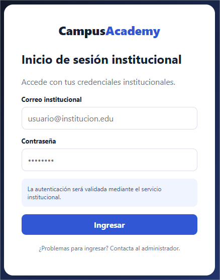

**Figura 13. Mockup de Login Institucional**

Pantalla inicial de acceso a la plataforma. Permite al usuario autenticarse mediante sus credenciales institucionales antes de acceder a los servicios académicos.

### Mockup 2 — Catálogo Académico

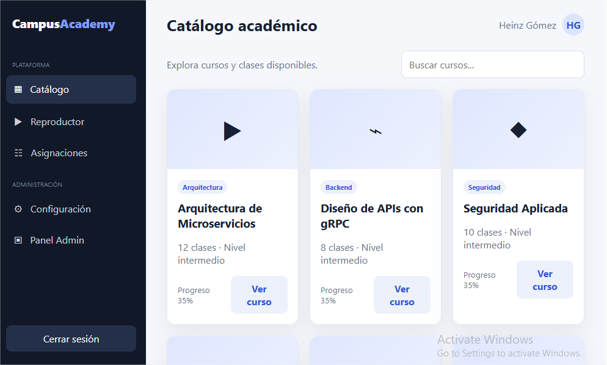

**Figura 14. Mockup de Catálogo Académico**

Interfaz destinada a la consulta y búsqueda de cursos y contenido académico. Permite filtrar y seleccionar cursos disponibles para el usuario.

### Mockup 3 — Reproductor de Clases

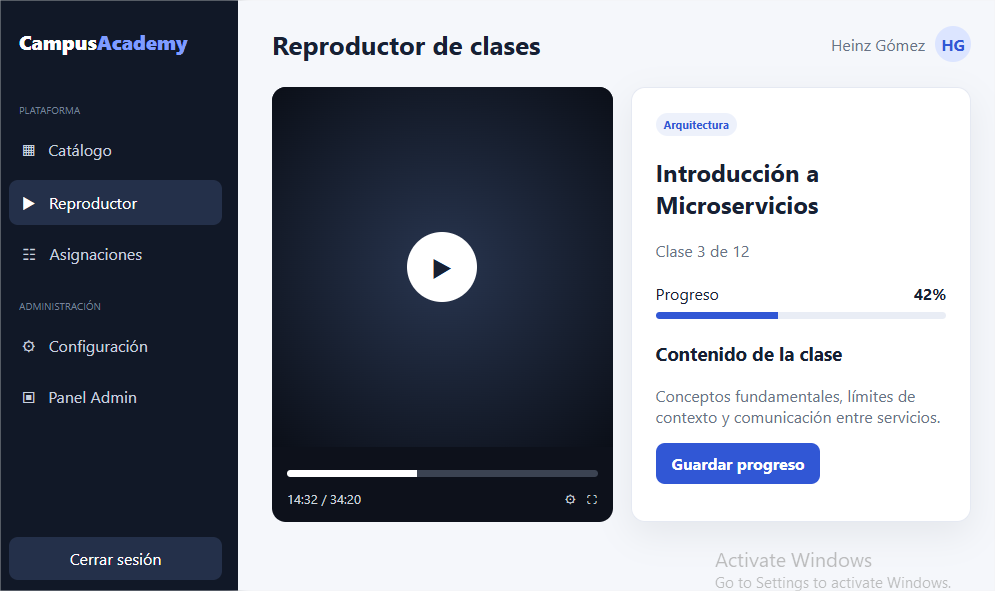

**Figura 15. Mockup de Reproductor de Clases**

Interfaz utilizada para reproducir las clases académicas. Incluye controles de reproducción y visualización del progreso del usuario dentro de la clase.

### Mockup 4 — Gestión de Asignaciones

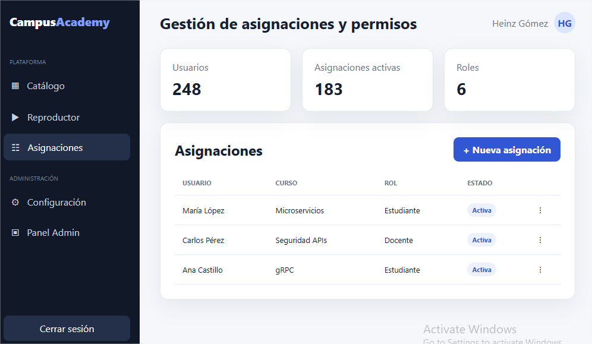

**Figura 16. Mockup de Gestión de Asignaciones**

Permite administrar las asignaciones de cursos y roles a los usuarios. Incluye la consulta de asignaciones existentes y la creación de nuevas asignaciones.

### Mockup 5 — Configuración

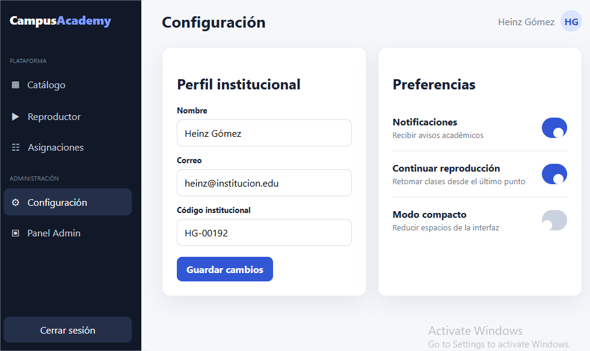

**Figura 17. Mockup de Configuración**

Pantalla destinada a la administración del perfil institucional y las preferencias del usuario, incluyendo notificaciones y comportamiento de reproducción.

### Mockup 6 — Panel Administrativo

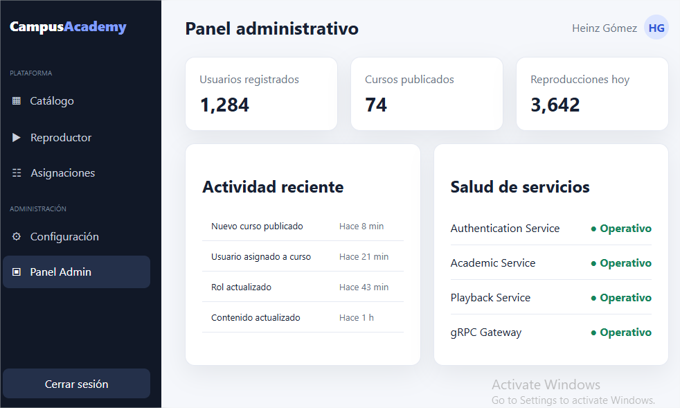

**Figura 18. Mockup de Panel Administrativo**

Panel de supervisión de la plataforma que presenta indicadores generales, actividad reciente y estado de los principales servicios del sistema.