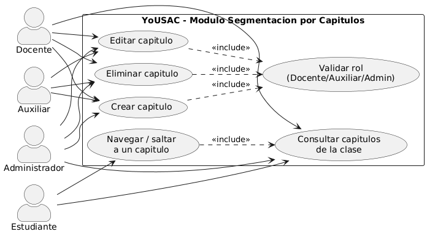
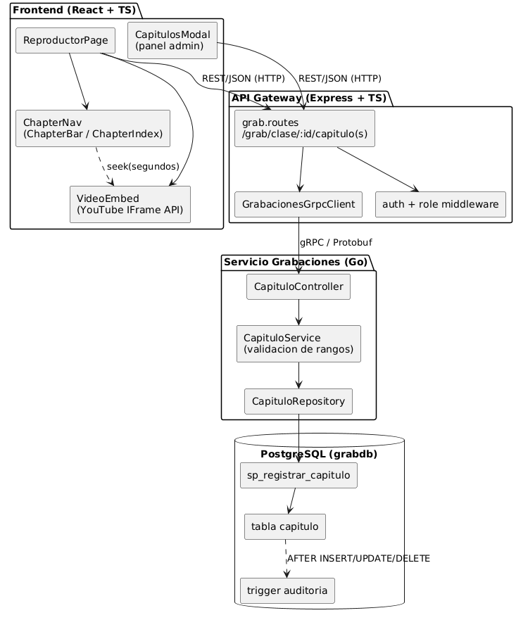
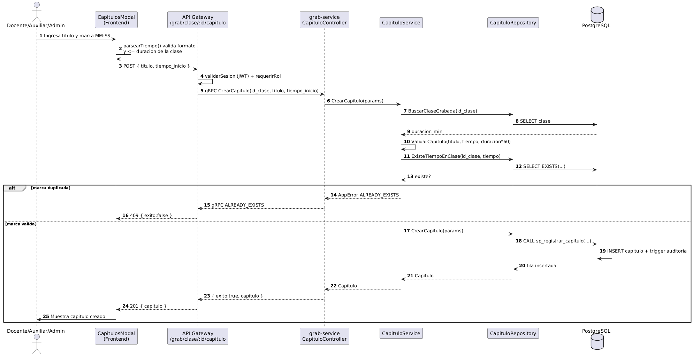
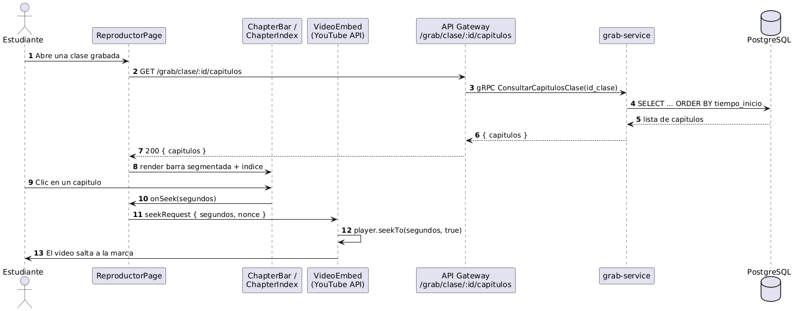
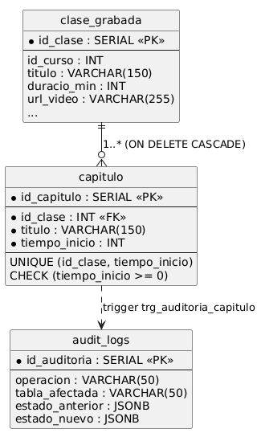
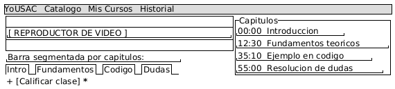
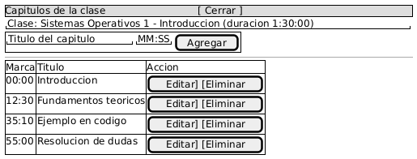

# Fase 2 — Módulo: Segmentación por Capítulos (Video Chapters)

> Documento técnico del módulo **Segmentación por capítulos** de la plataforma **YoUSAC / Quetxal TV** (Proyecto Fase 2).
> Responsable del módulo: **Heinz Gómez**.

---

## Índice

- [1. Introducción](#1-introducción)
- [2. Requerimientos](#2-requerimientos)
  - [2.1 Requerimientos Funcionales](#21-requerimientos-funcionales)
  - [2.2 Requerimientos No Funcionales](#22-requerimientos-no-funcionales)
- [3. Casos de Uso](#3-casos-de-uso)
  - [3.1 Diagrama de casos de uso](#31-diagrama-de-casos-de-uso)
  - [3.2 Narrativa expandida](#32-narrativa-expandida)
- [4. Vista 4+1](#4-vista-41)
  - [4.1 Vista Lógica y de Componentes](#41-vista-lógica-y-de-componentes)
  - [4.2 Vista de Procesos (Secuencia)](#42-vista-de-procesos-secuencia)
- [5. Modelo de Datos (DER extendido)](#5-modelo-de-datos-der-extendido)
- [6. Contratos e Interfaces](#6-contratos-e-interfaces)
- [7. Mockups UI/UX](#7-mockups-uiux)
- [8. Pruebas Unitarias](#8-pruebas-unitarias)
- [9. Archivos Crudos](#9-archivos-crudos)
- [10. Conclusiones](#10-conclusiones)

---

## 1. Introducción

El módulo de **Segmentación por Capítulos** permite estructurar cada clase grabada en **bloques temáticos** (por ejemplo: `00:00 - Introducción`, `12:30 - Fundamentos teóricos`, `35:10 - Ejemplo en código`). Docentes, auxiliares y administradores gestionan estos capítulos desde el panel de administración, mientras que el estudiante navega la clase mediante una **barra de avance segmentada** y un **índice lateral** que permite **saltar directamente** al segundo exacto de cada tema.

El módulo se implementa sobre el microservicio **Grabaciones (Go)** —dueño de la entidad `clase_grabada`—, se expone al frontend a través del **API Gateway** mediante **gRPC/Protocol Buffers**, y persiste en la base de datos relacional `grabdb` (PostgreSQL) siguiendo el patrón *Database per Microservice*. El modelo de tiempo adoptado es por **marca de inicio** (el fin de un capítulo es el inicio del siguiente), coherente con el ejemplo del enunciado.

---

## 2. Requerimientos

### 2.1 Requerimientos Funcionales

| Código | Descripción | Prioridad |
|--------|-------------|-----------|
| RF-26 | El docente, auxiliar o administrador debe poder **crear, editar y eliminar** capítulos de una clase grabada, indicando un título y una marca de tiempo de inicio. | Alta |
| RF-27 | El sistema debe **validar** que la marca de tiempo del capítulo sea no negativa, que no exceda la duración de la clase y que no se repita dentro de la misma clase. | Alta |
| RF-28 | El estudiante debe poder **consultar** los capítulos de una clase, visualizarlos como una **barra de avance segmentada** y un **índice lateral**, y **saltar** directamente a la marca de tiempo de cualquier capítulo. | Alta |

### 2.2 Requerimientos No Funcionales

| Código | Descripción |
|--------|-------------|
| RNF-C1 | La consulta de capítulos de una clase debe responder en menos de 2 segundos y devolverlos **ordenados** por marca de tiempo ascendente. |
| RNF-C2 | Toda operación de escritura sobre capítulos (INSERT/UPDATE/DELETE) debe quedar **auditada** automáticamente mediante trigger en la base de datos. |
| RNF-C3 | Ningún cliente externo se comunica directamente con el microservicio: el 100% del tráfico pasa por el **API Gateway** y la comunicación interna es **gRPC sobre HTTP/2**. |
| RNF-C4 | La unicidad de la marca de tiempo por clase debe garantizarse a nivel de base de datos mediante una **restricción UNIQUE**. |

---

## 3. Casos de Uso

### 3.1 Diagrama de casos de uso



### 3.2 Narrativa expandida

**CDU: Crear capítulo**

| Campo | Detalle |
|-------|---------|
| **Actor principal** | Docente / Auxiliar / Administrador |
| **Precondición** | El actor está autenticado (JWT válido) y posee un rol autorizado; la clase grabada existe. |
| **Flujo principal** | 1. El actor abre el gestor de capítulos de una clase. 2. Ingresa el título y la marca de tiempo en formato `MM:SS`. 3. El frontend valida el formato y que la marca no exceda la duración. 4. El gateway valida sesión y rol. 5. El servicio comprueba que la clase existe, que la marca está en rango y que no está duplicada. 6. Se registra el capítulo mediante el procedimiento almacenado y se audita el cambio. |
| **Flujo alterno** | *5a.* Si la marca ya existe para esa clase, el sistema responde `409 (ALREADY_EXISTS)` y no crea el capítulo. *3a/5b.* Si la marca es negativa o excede la duración, se responde `400 (INVALID_ARGUMENT)`. |
| **Postcondición** | La clase queda segmentada con el nuevo capítulo, disponible para la barra segmentada y el índice del reproductor. |

**CDU: Navegar / saltar a un capítulo**

| Campo | Detalle |
|-------|---------|
| **Actor principal** | Estudiante |
| **Precondición** | La clase tiene capítulos definidos. |
| **Flujo principal** | 1. El estudiante abre la clase. 2. El reproductor consulta los capítulos y pinta la barra segmentada y el índice lateral. 3. El estudiante hace clic en un capítulo. 4. El reproductor salta (`seekTo`) a la marca de tiempo exacta. |
| **Postcondición** | La reproducción continúa desde el segundo del capítulo seleccionado. |

---

## 4. Vista 4+1

### 4.1 Vista Lógica y de Componentes

Los componentes agregados por el módulo y su relación con la arquitectura existente:



- **Frontend (React + TS):** `ReproductorPage` orquesta el reproductor; `ChapterNav` aporta `ChapterBar` (barra segmentada) y `ChapterIndex` (índice lateral); `VideoEmbed` ejecuta el salto (`seekTo`) vía YouTube IFrame API; `CapitulosModal` es la herramienta de gestión del panel admin.
- **API Gateway (Express + TS):** rutas REST bajo `/grab/clase/:id/capitulo(s)` y `/grab/capitulo/:id`, protegidas por los middlewares de autenticación (JWT) y de rol, que delegan por gRPC en el servicio.
- **Servicio Grabaciones (Go):** `CapituloController → CapituloService → CapituloRepository`, respetando inyección de dependencias y separación de responsabilidades (SOLID).
- **PostgreSQL (grabdb):** tabla `capitulo`, procedimiento `sp_registrar_capitulo` y trigger de auditoría `trg_auditoria_capitulo`.

### 4.2 Vista de Procesos (Secuencia)

**Crear capítulo (panel admin):**



**Consulta y navegación en el reproductor:**



---

## 5. Modelo de Datos (DER extendido)



Definición en la base de datos `grabdb` (extracto de `servicios/grabaciones/database/init.sql`):

```sql
CREATE TABLE capitulo (
    id_capitulo SERIAL PRIMARY KEY,
    id_clase INT NOT NULL,
    titulo VARCHAR(150) NOT NULL,
    tiempo_inicio INT NOT NULL, -- segundos desde el inicio del video
    CONSTRAINT fk_capitulo_clase
        FOREIGN KEY (id_clase) REFERENCES clase_grabada(id_clase) ON DELETE CASCADE,
    CONSTRAINT chk_capitulo_tiempo CHECK (tiempo_inicio >= 0),
    CONSTRAINT uq_capitulo_clase_tiempo UNIQUE (id_clase, tiempo_inicio)
);
```

- **Persistencia por microservicio:** la entidad `capitulo` vive en `grabdb`, la misma base del microservicio de Grabaciones dueño de `clase_grabada`.
- **Procedimiento almacenado** `sp_registrar_capitulo(p_id_clase, p_titulo, p_tiempo_inicio)`: valida existencia de la clase, marca no negativa y unicidad antes de insertar.
- **Trigger** `trg_auditoria_capitulo`: registra INSERT/UPDATE/DELETE en `audit_logs` con estado anterior/nuevo en JSONB.

---

## 6. Contratos e Interfaces

### 6.1 Contrato gRPC (`contratos/grabaciones.proto`)

```proto
rpc CrearCapitulo(CrearCapituloRequest) returns (CrearCapituloResponse);
rpc EditarCapitulo(EditarCapituloRequest) returns (EditarCapituloResponse);
rpc EliminarCapitulo(EliminarCapituloRequest) returns (EliminarCapituloResponse);
rpc ConsultarCapitulosClase(ConsultarCapitulosClaseRequest) returns (ConsultarCapitulosClaseResponse);

message Capitulo {
  int32 id_capitulo = 1;
  int32 id_clase = 2;
  string titulo = 3;
  int32 tiempo_inicio = 4; // segundos
}
```

### 6.2 Endpoints REST (API Gateway)

| Método | Ruta | Roles | Descripción |
|--------|------|-------|-------------|
| `GET` | `/grab/clase/:id/capitulos` | Estudiante, Docente, Auxiliar, Administrador | Lista los capítulos de la clase, ordenados por marca de tiempo. |
| `POST` | `/grab/clase/:id/capitulo` | Docente, Auxiliar, Administrador | Crea un capítulo `{ titulo, tiempo_inicio }`. |
| `PATCH` | `/grab/capitulo/:id_capitulo` | Docente, Auxiliar, Administrador | Edita el título y/o la marca de tiempo. |
| `DELETE` | `/grab/capitulo/:id_capitulo` | Docente, Auxiliar, Administrador | Elimina el capítulo. |

---

## 7. Mockups UI/UX

**Reproductor con barra segmentada e índice de capítulos:**



**Panel admin — modal de gestión de capítulos:**



---

## 8. Pruebas Unitarias

Suite en Go (`servicios/grabaciones/src/services/capitulo_service_test.go`), ejecutada con `go test`:

- `TestValidarCapitulo` — valida rangos de marcas de tiempo (marca dentro del rango, final exacto, título vacío, marca negativa, marca fuera de la duración, sin duración conocida).
- `TestCrearCapitulo_Exito` — creación válida y normalización del título.
- `TestCrearCapitulo_ClaseInexistente` — `NOT_FOUND` cuando la clase no existe.
- `TestCrearCapitulo_TiempoFueraDeRango` — `INVALID_ARGUMENT` por marca fuera de la duración.
- `TestCrearCapitulo_TiempoDuplicado` — `ALREADY_EXISTS` por marca repetida.
- `TestEditarCapitulo_NoExiste` — `NOT_FOUND` al editar un capítulo inexistente.
- `TestConsultarCapitulosClase_IdInvalido` — `INVALID_ARGUMENT` por id de clase inválido.

Resultado de ejecución:

```
ok  	servicio-grabaciones/services	0.004s   (PASS: 11 casos)
```

---

## 9. Archivos Crudos

Los archivos fuente editables de los diagramas (PlantUML) están en `documentacion/fase2/crudos/`:

| Diagrama | Archivo crudo |
|----------|---------------|
| Casos de uso | `crudos/cdu-capitulos.puml` |
| Componentes | `crudos/componentes-capitulos.puml` |
| Secuencia — Crear capítulo | `crudos/secuencia-crear-capitulo.puml` |
| Secuencia — Reproductor | `crudos/secuencia-reproductor-capitulos.puml` |
| DER extendido | `crudos/der-capitulos.puml` |
| Mockup — Reproductor | `crudos/mockup-reproductor-capitulos.puml` |
| Mockup — Panel admin | `crudos/mockup-admin-capitulos.puml` |

> Renderizables con PlantUML (motor **Smetana** para diagramas de estructura, no requiere Graphviz).

---

## 10. Conclusiones

- El módulo de segmentación por capítulos extiende la plataforma sin acoplarse a otros dominios: la entidad `capitulo` se ubica en la base del microservicio de Grabaciones y se expone únicamente por gRPC a través del API Gateway, respetando el patrón *Database per Microservice* y la regla de punto de entrada único.
- La lógica de negocio (validación de rangos de marcas de tiempo, unicidad y existencia de la clase) reside en la capa de servicio y está **cubierta por pruebas unitarias**, mientras que la base de datos refuerza las mismas reglas con `CHECK`, `UNIQUE` y un procedimiento almacenado, más auditoría automática por trigger.
- En el cliente, la experiencia de aprendizaje se enriquece con una barra de avance segmentada y un índice de salto directo, transformando el consumo lineal del video en una navegación temática.
