# Informe Técnico — Práctica 5

**Cuaderno de Apuntes Markdown, Container Registry y Pipeline CI Automatizado**
Plataforma **YoUSAC / Quetxal TV** — Proyecto Fase 2.

---

## Índice

- [Informe Técnico — Práctica 5](#informe-técnico--práctica-5)
  - [Índice](#índice)
  - [1. Introducción](#1-introducción)
  - [2. Pipeline de Integración Continua (CI)](#2-pipeline-de-integración-continua-ci)
    - [2.1 Estructura (jobs)](#21-estructura-jobs)
    - [2.2 Cortocircuito ante fallos](#22-cortocircuito-ante-fallos)
    - [2.3 Disparadores](#23-disparadores)
    - [2.4 Requisito de configuración (una sola vez)](#24-requisito-de-configuración-una-sola-vez)
    - [2.5 Evidencia de ejecución](#25-evidencia-de-ejecución)
  - [3. Container Registry (GHCR)](#3-container-registry-ghcr)
    - [3.1 Imágenes publicadas](#31-imágenes-publicadas)
    - [3.3 Ejemplo de consumo](#33-ejemplo-de-consumo)
  - [4. Registry](#4-registry)
    - [Registry del Repositorio](#registry-del-repositorio)
    - [Imagen Servicio Autenticacion](#imagen-servicio-autenticacion)
    - [Imagen Servicio Inscripcion](#imagen-servicio-inscripcion)
    - [Imagen Servicio Grabaciones](#imagen-servicio-grabaciones)
    - [Imagen Servicio Analisis](#imagen-servicio-analisis)
    - [Imagen Servicio Historial](#imagen-servicio-historial)
    - [Imagen Servicio Notificaciones](#imagen-servicio-notificaciones)
    - [Imagen Servicio Recursos](#imagen-servicio-recursos)
    - [Imagen BD Autenticacion](#imagen-bd-autenticacion)
    - [Imagen DB Inscripcion](#imagen-db-inscripcion)
    - [Imagen DB Grabaciones](#imagen-db-grabaciones)
    - [Imagen DB Analisis](#imagen-db-analisis)
    - [Imagen DB Historial](#imagen-db-historial)
    - [Imagen DB Notificaciones](#imagen-db-notificaciones)
    - [Imagen DB Recursos](#imagen-db-recursos)
  - [5. Suites de Pruebas Unitarias](#5-suites-de-pruebas-unitarias)
  - [6. Subida de Imagenes Docker a Github Container Registry](#6-subida-de-imagenes-docker-a-github-container-registry)
  - [7. Cuaderno de Apuntes (evidencia funcional)](#7-cuaderno-de-apuntes-evidencia-funcional)
  - [8. Conclusiones](#8-conclusiones)

---

## 1. Introducción

Este informe documenta la automatización del ciclo de integración continua de la plataforma. Se implementó un **pipeline de CI en GitHub Actions** que, ante cada Pull Request o push, ejecuta las **suites de pruebas unitarias** de los microservicios y, únicamente si todas pasan, **construye y publica las imágenes Docker** en el **Container Registry de GitHub (GHCR)** con etiquetas de versionamiento semántico. La publicación manual queda prohibida: el 100% de las imágenes las sube el pipeline.

---

## 2. Pipeline de Integración Continua (CI)

**Archivo:** `.github/workflows/ci.yml`

### 2.1 Estructura (jobs)

| Job | Qué hace |
|-----|----------|
| `test-go` | Instala `protoc` + plugins, **genera los stubs gRPC** y ejecuta `go test ./...` en `grabaciones`, `recursos` e `historial`. |
| `test-node` | Ejecuta `npm test` en `autenticacion`, `inscripcion` y `api-gateway` **solo si el servicio define un script de pruebas**. |
| `test-python` | Ejecuta `pytest` en `analisis` y `notificaciones` **solo si existen archivos de prueba**. |
| `build-and-push` | Construye y publica las 16 imágenes en GHCR. **`needs: [test-go, test-node, test-python]`**. |

### 2.2 Cortocircuito ante fallos

El job `build-and-push` declara `needs` sobre los tres jobs de prueba. Si **cualquier** prueba falla, GitHub Actions **no ejecuta** `build-and-push`, por lo que **ninguna imagen se publica** en el Registry. Esto cumple el requisito de cortocircuitar la subida ante pruebas fallidas.

### 2.3 Disparadores

- `pull_request`: corre las pruebas en cada PR (evidencia de CI en verde antes de integrar).
- `push` a `develop` / `main` / `release`: corre pruebas y, si pasan, publica imágenes.
- `workflow_dispatch`: ejecución manual desde la pestaña *Actions*.

### 2.4 Requisito de configuración (una sola vez)

Para que el `GITHUB_TOKEN` pueda publicar en GHCR:
**Settings → Actions → General → Workflow permissions → “Read and write permissions”**.

### 2.5 Evidencia de ejecución

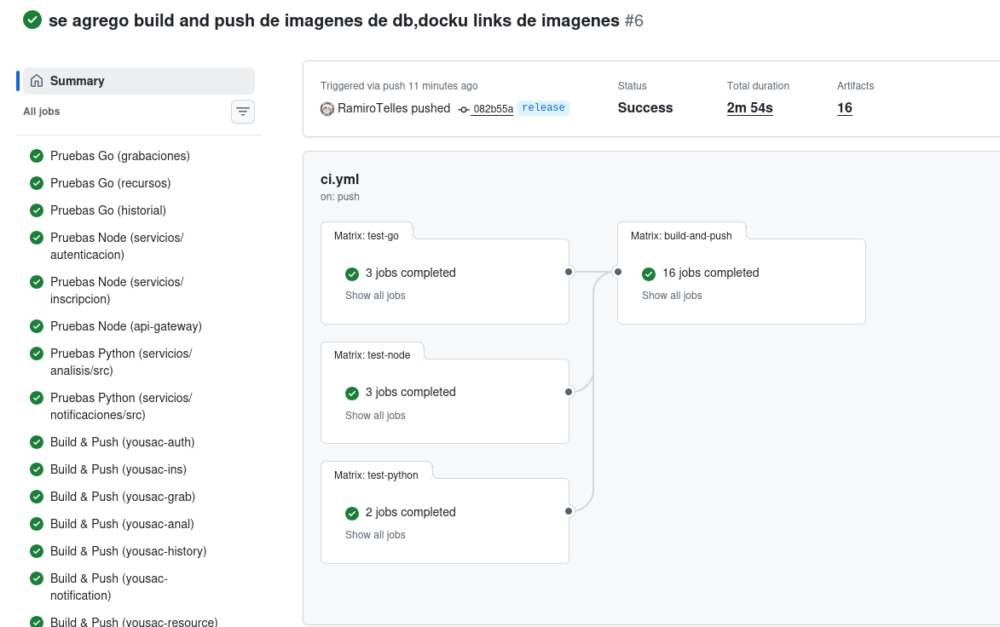

---

## 3. Container Registry (GHCR)

Las imágenes se publican en `ghcr.io/<owner>/<imagen>` con etiquetas generadas automáticamente por `docker/metadata-action` (nombre de rama, tag de release, versión semántica, short-SHA y `latest` en la rama por defecto).

### 3.1 Imágenes publicadas

| Servicio | Imagen |
|----------|--------|
| Autenticación | `ghcr.io/<owner>/yousac-auth` |
| Inscripción | `ghcr.io/<owner>/yousac-ins` |
| Grabaciones | `ghcr.io/<owner>/yousac-grab` |
| Analítica | `ghcr.io/<owner>/yousac-anal` |
| Historial | `ghcr.io/<owner>/yousac-history` |
| Notificaciones | `ghcr.io/<owner>/yousac-notification` |
| Recursos (apuntes/materiales) | `ghcr.io/<owner>/yousac-resource` |
| API Gateway | `ghcr.io/<owner>/yousac-api-gateway` |
| Frontend | `ghcr.io/<owner>/yousac-frontend` |
| DB Autenticación | `ghcr.io/<owner>/yousac-db-auth` |
| DB Inscripción | `ghcr.io/<owner>/yousac-db-ins` |
| DB Grabaciones | `ghcr.io/<owner>/yousac-db-grab` |
| DB Analítica | `ghcr.io/<owner>/yousac-db-anal` |
| DB Historial | `ghcr.io/<owner>/yousac-db-history` |
| DB Notificaciones | `ghcr.io/<owner>/yousac-db-notification` |
| DB Recursos (apuntes/materiales) | `ghcr.io/<owner>/yousac-db-resource` |

### 3.3 Ejemplo de consumo

```bash
docker pull ghcr.io/<owner>/yousac-grab:V1.2.0
```

---

## 4. Registry

### Registry del Repositorio 

https://github.com/RamiroTelles?tab=packages&repo_name=SA_PROYECTO_202010044

### Imagen Servicio Autenticacion

https://github.com/RamiroTelles/SA_PROYECTO_202010044/pkgs/container/yousac-auth

### Imagen Servicio Inscripcion

https://github.com/RamiroTelles/SA_PROYECTO_202010044/pkgs/container/yousac-ins

### Imagen Servicio Grabaciones

https://github.com/RamiroTelles/SA_PROYECTO_202010044/pkgs/container/yousac-grab

### Imagen Servicio Analisis

https://github.com/RamiroTelles/SA_PROYECTO_202010044/pkgs/container/yousac-anal

### Imagen Servicio Historial

https://github.com/RamiroTelles/SA_PROYECTO_202010044/pkgs/container/yousac-history

### Imagen Servicio Notificaciones

https://github.com/RamiroTelles/SA_PROYECTO_202010044/pkgs/container/yousac-notification

### Imagen Servicio Recursos

https://github.com/RamiroTelles/SA_PROYECTO_202010044/pkgs/container/yousac-resource

### Imagen BD Autenticacion

https://github.com/RamiroTelles/SA_PROYECTO_202010044/pkgs/container/yousac-db-auth

### Imagen DB Inscripcion

https://github.com/RamiroTelles/SA_PROYECTO_202010044/pkgs/container/yousac-db-ins

### Imagen DB Grabaciones

https://github.com/RamiroTelles/SA_PROYECTO_202010044/pkgs/container/yousac-db-grab

### Imagen DB Analisis

https://github.com/RamiroTelles/SA_PROYECTO_202010044/pkgs/container/yousac-db-anal

### Imagen DB Historial

https://github.com/RamiroTelles/SA_PROYECTO_202010044/pkgs/container/yousac-db-history

### Imagen DB Notificaciones

https://github.com/RamiroTelles/SA_PROYECTO_202010044/pkgs/container/yousac-db-notification

### Imagen DB Recursos 

https://github.com/RamiroTelles/SA_PROYECTO_202010044/pkgs/container/yousac-db-resource


## 5. Suites de Pruebas Unitarias

Las pruebas se ejecutan automáticamente en los job `test-go` `test-python` `test-node`. Resultados verificados:

**Servicio Grabaciones** (`servicios/grabaciones/`):

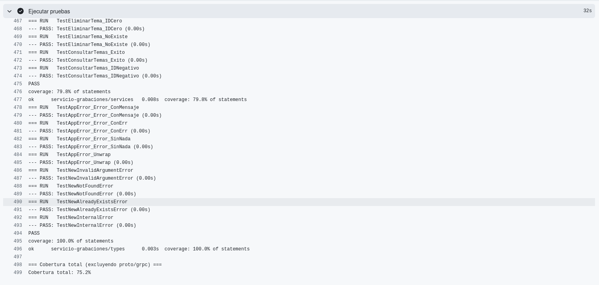

**Servicio Recursos** (`servicios/recursos/...`):

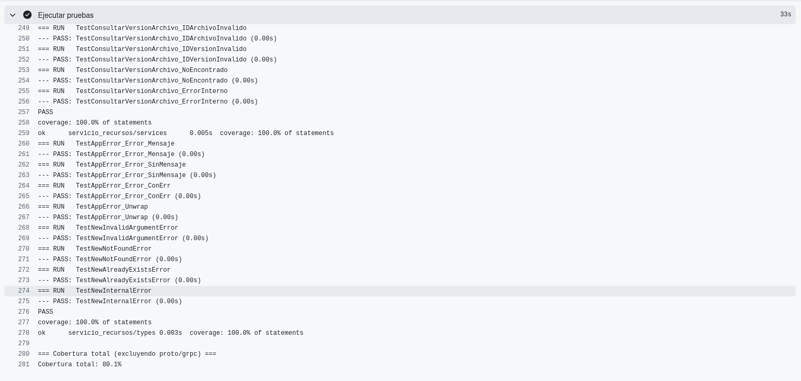

**Servicio Historial** (`servicios/historial/...`):

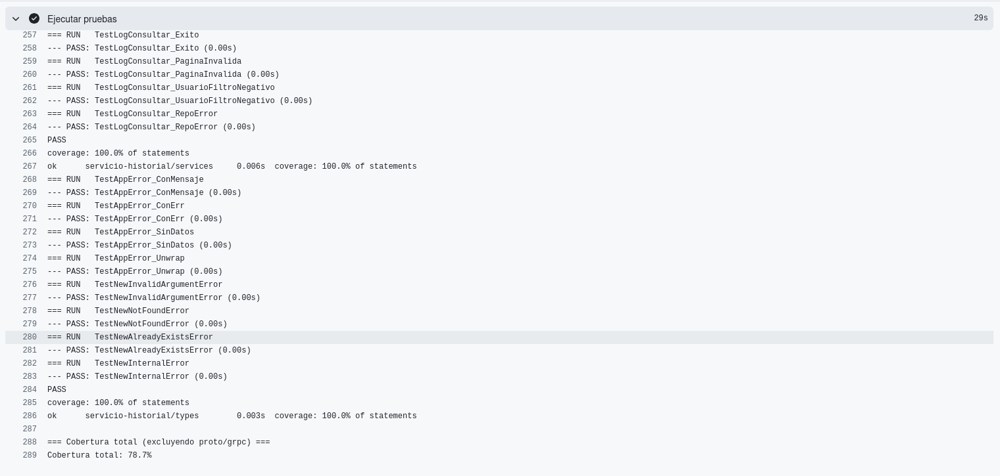

**Servicio Autenticacion** (`servicios/autenticacion/`):

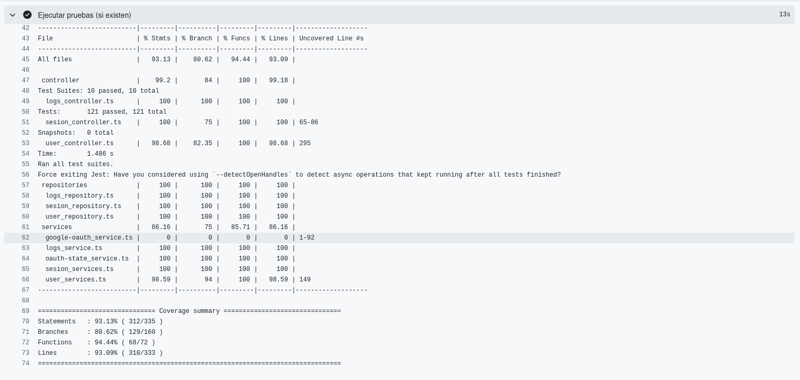

**Servicio Api-gateway** (`api-gateway/...`):

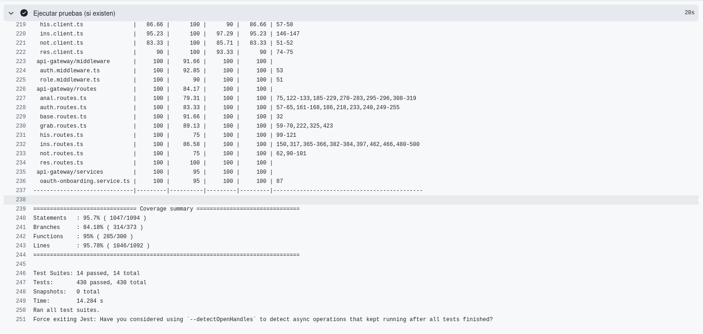

**Servicio Inscripcion** (`servicios/inscripcion/...`):

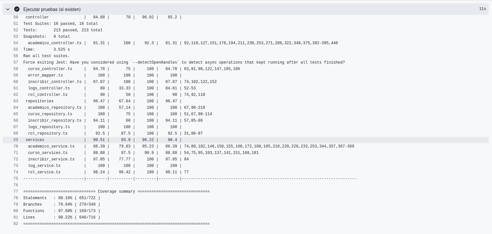

**Servicio Analisis** (`servicios/analisis/...`):

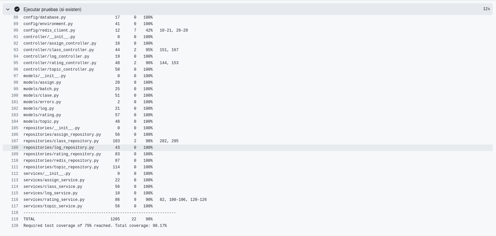

**Servicio Notificaciones** (`servicios/notificaciones/...`):

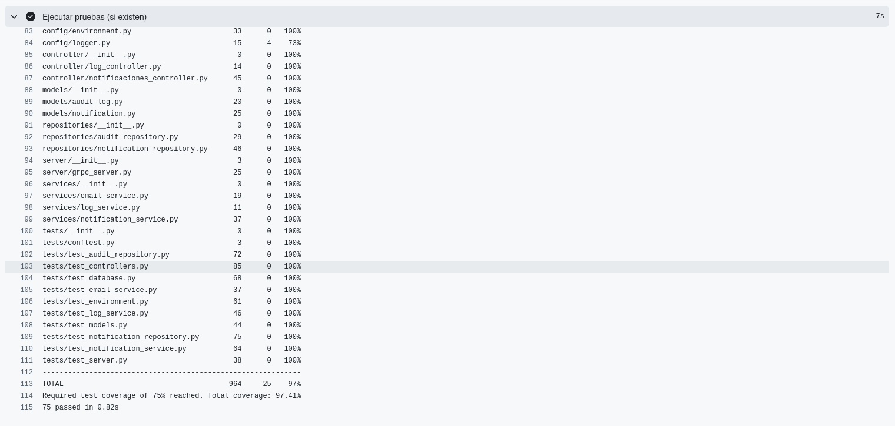


---

## 6. Subida de Imagenes Docker a Github Container Registry

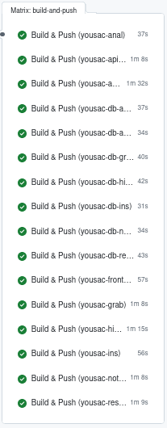

## 7. Cuaderno de Apuntes (evidencia funcional)

Vista de libreta 

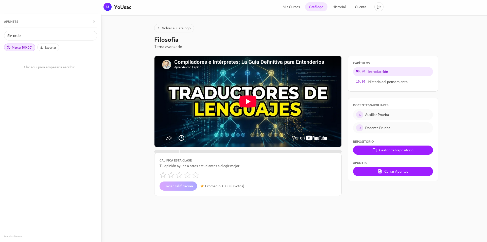

Vista Edicion

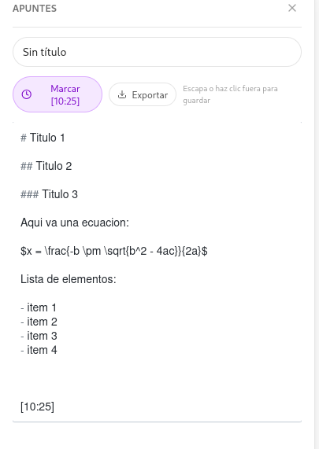

Vista Preview

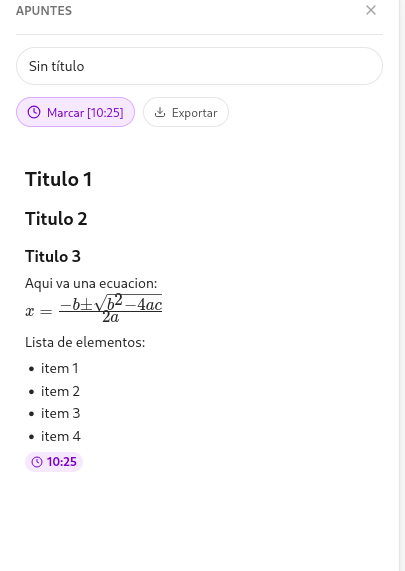

Marcar Referencia

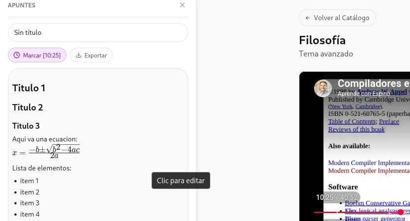

Boton Referencia

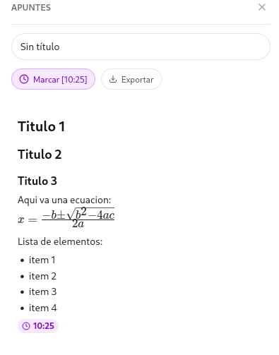

Boton Exportar

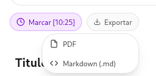

Markdown Exportado

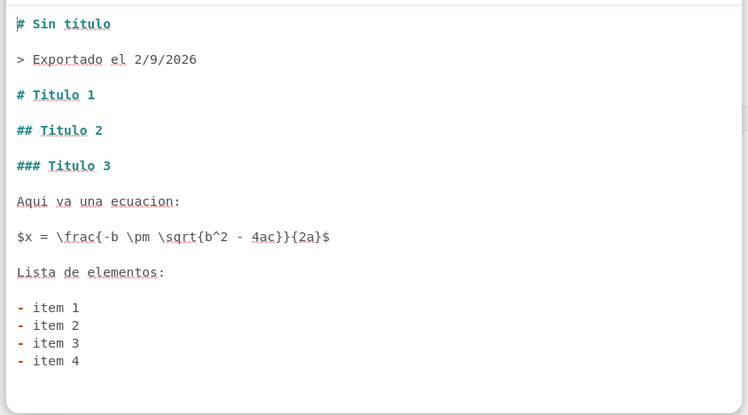

PDF Exportado

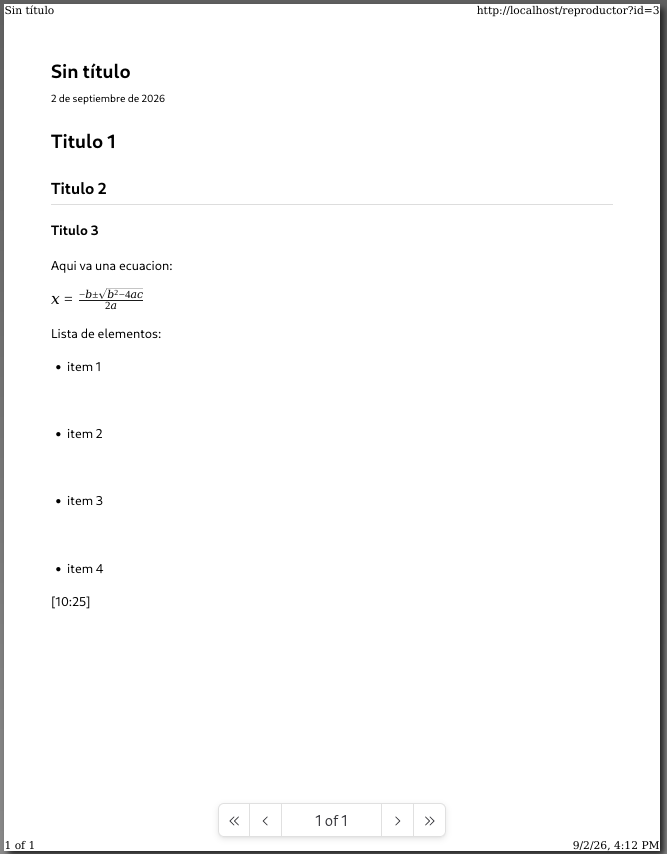


---

## 8. Conclusiones

- El pipeline de CI automatiza la verificación de calidad: cada cambio ejecuta las pruebas unitarias y, solo ante un resultado exitoso, promueve las imágenes al Registry, eliminando la subida manual y garantizando trazabilidad.
- El uso de GHCR con el `GITHUB_TOKEN` integrado simplifica la autenticación y el versionamiento semántico de las 9 imágenes de la plataforma.
- La estrategia de *jobs* con `needs` implementa el cortocircuito exigido: un fallo en pruebas detiene la publicación, protegiendo la integridad del Registry.
