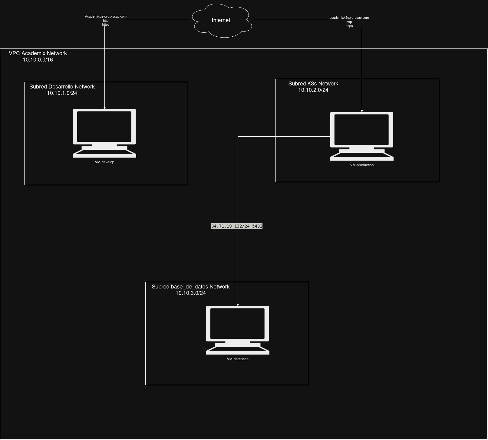
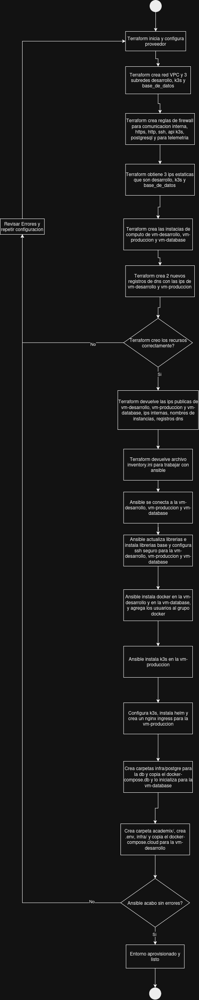
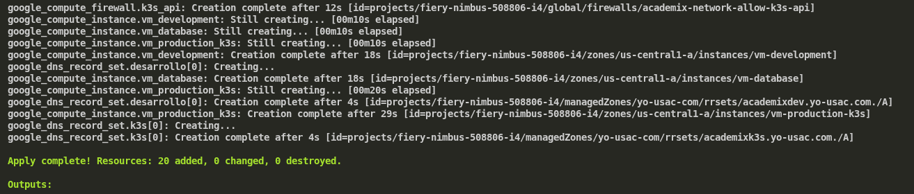
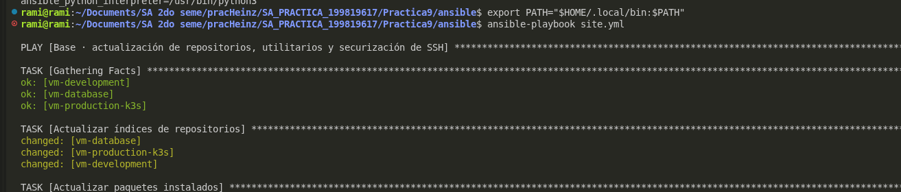
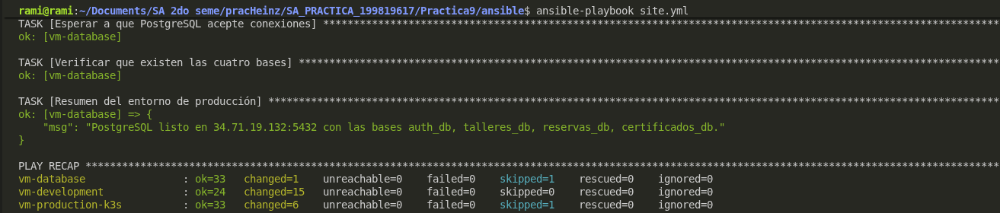

# Informe Técnico — Práctica 9

**Infraestructura como Código en la Nube: Terraform y Ansible**
Plataforma Academix Pass & CertiHub — Proyecto Fase 3.

Universidad de San Carlos de Guatemala
Facultad de Ingeniería
Escuela de Ciencias y Sistemas

> Responsable: Heinz Gómez — Carné 199819617

---

## Índice

- [Informe Técnico — Práctica 9](#informe-técnico--práctica-9)
  - [Índice](#índice)
  - [1. Introducción](#1-introducción)
  - [2. Arquitectura de red en la nube](#2-arquitectura-de-red-en-la-nube)
    - [2.1 Diagrama de la red](#21-diagrama-de-la-red)
    - [2.2 Subredes e instancias](#22-subredes-e-instancias)
    - [2.3 Tablas de enrutamiento](#23-tablas-de-enrutamiento)
    - [2.4 Reglas de firewall y puertos](#24-reglas-de-firewall-y-puertos)
    - [2.5 Resolución de nombres (DNS)](#25-resolución-de-nombres-dns)
  - [3. Flujo del aprovisionamiento](#3-flujo-del-aprovisionamiento)
  - [4. Matriz de decisiones técnicas](#4-matriz-de-decisiones-técnicas)
    - [4.1 Terraform frente a CloudFormation y scripts manuales](#41-terraform-frente-a-cloudformation-y-scripts-manuales)
    - [4.2 Ansible frente a Dockerfiles en el SO base](#42-ansible-frente-a-dockerfiles-en-el-so-base)
  - [5. Tutorial de aprovisionamiento](#5-tutorial-de-aprovisionamiento)
    - [5.1 Requisitos previos](#51-requisitos-previos)
    - [5.2 Paso 1 · Aprovisionar la infraestructura con Terraform](#52-paso-1--aprovisionar-la-infraestructura-con-terraform)
    - [5.3 Paso 2 · Configurar las máquinas con Ansible](#53-paso-2--configurar-las-máquinas-con-ansible)
    - [5.4 Paso 3 · Verificación](#54-paso-3--verificación)
    - [5.5 Desmantelar la infraestructura](#55-desmantelar-la-infraestructura)
  - [6. Conclusiones](#6-conclusiones)

---

## 1. Introducción

Este informe documenta el aprovisionamiento de la infraestructura de la plataforma en la nube. El despliegue está resuelto con dos herramientas que cubren capas distintas y complementarias.

Terraform se encarga de crear la infraestructura: red privada virtual, subredes, reglas de firewall, direcciones IP estáticas, instancias de Compute Engine y registros de DNS, todo descrito en código declarativo y gestionado con estado.

Ansible se encarga de configurar el sistema operativo de esas máquinas recién creadas, ejecutando playbooks por SSH y sin instalar agente: repositorios y endurecimiento de SSH, motor Docker, clúster K3s con su controlador de ingress y emisor de certificados TLS, carpeta de aplicación con su archivo de entorno y servidor PostgreSQL.

La separación de responsabilidades es deliberada: Terraform decide qué existe, Ansible decide cómo está configurado y los contenedores Docker empaquetan la aplicación que corre dentro. Ninguna de las dos capas asume el trabajo de la otra, y ambas pueden re-ejecutarse sin destruir lo ya construido.

---

## 2. Arquitectura de red en la nube

Entorno: proyecto fiery-nimbus-508806-i4, región us-central1, zona us-central1-a.

### 2.1 Diagrama de la red



Los tres servicios de Google Cloud habilitados por el código son Compute Engine y Cloud DNS; la zona DNS yo-usac-com no la crea el proyecto, solo se consulta como fuente de datos.

### 2.2 Subredes e instancias

| Subred | Rango CIDR | Instancia | IP interna | IP externa (fija) | Tipo | Disco |
|---|---|---|---|---|---|---|
| academix-network-desarrollo | 10.10.1.0/24 | vm-development | 10.10.1.2 | academix-ip-desarrollo | e2-medium | 10 GB pd-balanced |
| academix-network-k3s | 10.10.2.0/24 | vm-production-k3s | 10.10.2.2 | academix-ip-k3s | e2-standard-2 | 25 GB pd-balanced |
| academix-network-base-de-datos | 10.10.3.0/24 | vm-database | 10.10.3.2 | academix-ip-base-de-datos | e2-medium | 15 GB pd-balanced |

Las tres direcciones IP externas son estáticas y reservadas por Terraform, de modo que sobreviven a un reinicio de la máquina y no cambian al destruir y recrear la infraestructura. Toda la red interna cae dentro del rango 10.10.0.0/16.

### 2.3 Tablas de enrutamiento

La VPC se crea con subredes automáticas desactivadas y modo de enrutamiento REGIONAL, por lo que las rutas efectivas son las siguientes:

| Ruta | Destino | Próximo salto | Origen |
|---|---|---|---|
| Ruta predeterminada a Internet | 0.0.0.0/0 | Internet Gateway | Creada automáticamente por Google Cloud al crear la VPC |
| Ruta de la subred de desarrollo | 10.10.1.0/24 | Red local | Implícita al crear la subred |
| Ruta de la subred de K3s | 10.10.2.0/24 | Red local | Implícita al crear la subred |
| Ruta de la subred de base de datos | 10.10.3.0/24 | Red local | Implícita al crear la subred |

No se definió Cloud Router ni Cloud NAT: cada instancia sale a Internet por su propia dirección externa estática, que es además la que resuelven los registros DNS. El tráfico este-oeste entre las tres subredes viaja por la red local sin salir a Internet, y está permitido íntegramente por la regla interna.

### 2.4 Reglas de firewall y puertos

Todas las reglas son de tipo INGRESS con prioridad 1000 y se aplican mediante etiquetas de instancia, no a la red completa.

| Regla | Protocolo y puertos | Origen permitido | Etiquetas de destino |
|---|---|---|---|
| academix-allow-internal | TCP, UDP e ICMP (todos los puertos) | 10.10.0.0/16 | academix |
| academix-allow-ssh | TCP 22 | 0.0.0.0/0 | academix |
| academix-allow-http-https | TCP 80 y 443 | 0.0.0.0/0 | web |
| academix-allow-k3s-api | TCP 6443 | 0.0.0.0/0 | k3s |
| academix-allow-postgres | TCP 5432 | 10.10.0.0/16 | database |
| academix-allow-telemetry | TCP 3000, 9090 y 9100 | 10.10.0.0/16 | academix |

Flujos resultantes:

- Norte-sur (desde Internet): SSH 22 hacia las tres máquinas, HTTP y HTTPS 80/443 hacia vm-development y vm-production-k3s, y API de Kubernetes 6443 hacia vm-production-k3s.
- Este-oeste (dentro de la VPC): todo el tráfico entre las tres subredes, sobre el cual se superponen las reglas explícitas de PostgreSQL 5432 (pods de K3s contra vm-database) y de telemetría.
- Excluido deliberadamente: PostgreSQL y los puertos de telemetría no están abiertos a Internet, solo al rango interno 10.10.0.0/16. La dirección IP de quien ejecuta los comandos es dinámica, por lo que restringirla en SSH y en la API de Kubernetes haría perder el acceso en cuanto cambie; en su lugar, la telemetría se deja cerrada y se recomienda usar un túnel SSH para consultarla.

### 2.5 Resolución de nombres (DNS)

| Registro | Tipo | TTL | Destino |
|---|---|---|---|
| academixdev.yo-usac.com | A | 60 | IP externa de vm-development |
| academixk3s.yo-usac.com | A | 60 | IP externa de vm-production-k3s |

Ambos registros pertenecen a la zona yo-usac-com, que se toma como fuente de datos y no se modifica. El registro academix.yo-usac.com, que apunta al servicio de front-end desplegado en la plataforma externa, no es gestionado por este código y queda intacto.

---

## 3. Flujo del aprovisionamiento



Detalle de cada etapa:

1. Terraform plan — compara el código con el estado guardado y muestra qué se crearía, modificaría o destruiría, sin tocar nada. Es el paso de revisión.
2. Terraform apply — ejecuta el plan. En la primera pasada crea la VPC, las tres subredes, las seis reglas de firewall, las tres IP estáticas, las tres instancias y los dos registros DNS. En pasadas siguientes solo ajusta lo que difiere.
3. Estado — el archivo .tfstate registra el recurso real de cada elemento declarado. Es lo que permite que Terraform detecte cambios hechos fuera del código y que se pueda re-ejecutar cuantas veces haga falta sin duplicar recursos.
4. Ansible — toma el inventario generado desde la propia salida de Terraform y conecta por SSH a cada máquina para llevarla al estado deseado, en el orden documentado en el archivo site.yml:

```
01 base      → actualización de repositorios, utilitarios y endurecimiento de SSH   (las 3 VMs)
02 docker    → motor Docker, Docker Compose y grupo docker                          (vm-development, vm-database)
03 k3s       → instalación de K3s como servidor/control-plane y extracción          (vm-production-k3s)
              del kubeconfig a la máquina de administración
04 ingress   → controlador ingress-nginx, cert-manager y emisor de                 (vm-production-k3s)
              Let's Encrypt
05 entorno   → carpeta academix/ con su archivo de entorno y estructura de carpetas (vm-development, vm-database)
06 db        → compose de PostgreSQL, script de inicialización y arranque           (vm-database)
```

5. Listo — al terminar, las tres máquinas quedan configuradas y el sistema puede desplegar las imágenes de la aplicación sobre ellas.

---

## 4. Matriz de decisiones técnicas

### 4.1 Terraform frente a CloudFormation y scripts manuales

| Decisión técnica | Qué | Por qué | Para qué |
|---|---|---|---|
| Terraform para el aprovisionamiento de la infraestructura | Herramienta de Infrastructure as Code declarativa. Todo lo que sostiene el sistema está escrito en código: una VPC, tres subredes (desarrollo, base de datos y producción K3s), seis reglas de firewall, tres direcciones IP estáticas, tres instancias de Compute Engine y dos registros DNS. El estado de esos recursos queda guardado y cada ejecución empieza con un plan que muestra el cambio antes de aplicarlo. | Se comparó contra CloudFormation y contra scripts manuales con gcloud. CloudFormation solo entiende recursos de AWS y este laboratorio corre sobre Google Cloud, lo que obligaría a mantener dos proveedores o migrar todo; además Terraform es multicloud, por lo que la misma plantilla sigue sirviendo si el proveedor cambia. Un script gcloud es imperativo: describe pasos, no un estado deseado, así que si alguien modifica un recurso desde la consola el script no lo detecta y al re-ejecutarlo simplemente repite comandos sin corregir nada; Terraform en cambio compara el estado real con el declarado y solo modifica lo que difiere, dejando además un registro de qué cambió y cuándo. | Reproducir la infraestructura desde cero: si la red se borra o hace falta un ambiente de pruebas idéntico, se reconstruye con un solo comando. El plan previo permite revisar qué se va a crear o destruir antes de tocar producción, y el estado compartido evita que dos personas ejecuten la misma operación al mismo tiempo. |

### 4.2 Ansible frente a Dockerfiles en el SO base

| Decisión técnica | Qué | Por qué | Para qué |
|---|---|---|---|
| Ansible para la configuración del sistema operativo | Herramienta de orquestación que lleva una VM recién creada al estado deseado ejecutando playbooks por SSH, sin instalar agente en la máquina. Los plays cubren la base (repositorios, utilitarios y endurecimiento de SSH), Docker, K3s, el controlador ingress con cert-manager, la carpeta de aplicación con su archivo de entorno y PostgreSQL, aplicándose a cada VM según su grupo en el inventario. | Se evaluó resolverlo con Dockerfiles. Un Dockerfile empaqueta una aplicación y sus dependencias dentro de una imagen, pero no puede configurar la máquina que lo va a ejecutar: necesita Docker instalado, que es exactamente lo que pretende provisionar, y no alcanza tareas que viven fuera del contenedor, como endurecer SSH, desactivar swap, registrar usuarios en el grupo docker, instalar k3s como servicio del sistema o crear la estructura de carpetas con sus permisos. Ansible es declarativo e idempotente: cada tarea declara un estado y al volver a ejecutarse comprueba si ya se cumple, de modo que el juego completo de playbooks se puede correr en cada despliegue sin romper lo que ya funciona, mientras que con una imagen hay que reconstruirla y redesplegarla para cualquier cambio de configuración. El mismo conjunto de playbooks atiende las tres máquinas limitando por grupo, sin repetir lógica para cada una. | Dejar el aprovisionamiento completo en un comando reproducible y auditable, separando tres capas con responsabilidades distintas: Terraform crea la máquina, Ansible configura su sistema operativo y los Dockerfiles empaquetan la aplicación que corre dentro. |

---

## 5. Tutorial de aprovisionamiento

### 5.1 Requisitos previos

- Terraform 1.x instalado y autenticado contra Google Cloud.
- Ansible 2.16 o superior.
- Una llave SSH dedicada al laboratorio (en este proyecto, academix_lab).
- Acceso de lectura y escritura al proyecto de Google Cloud.

Variables de entorno usadas durante todo el proceso:

```bash
export PATH="$HOME/.local/bin:$PATH"
```

### 5.2 Paso 1 · Aprovisionar la infraestructura con Terraform

```bash
cd "/ruta/al/proyecto/Practica9/terraform"
```

Revisar qué se va a crear, modificar o destruir antes de ejecutar nada:

```bash
terraform plan -input=false
```

Aplicar los cambios:

```bash
terraform apply -input=false
```

Al terminar, Terraform reporta cuántos recursos se agregaron, modificaron o destruyeron. En una primera ejecución se esperan 17 adiciones.



Generar el inventario de Ansible a partir de las IP que acaba de asignar:

```bash
terraform output -raw inventory_ini > ../ansible/inventory.ini
cat ../ansible/inventory.ini
```

Este paso es obligatorio cada vez que se recrea la infraestructura: las direcciones IP pueden cambiar y Ansible se conectará a las que estén registradas en ese archivo.

### 5.3 Paso 2 · Configurar las máquinas con Ansible

```bash
cd ../ansible
export PATH="$HOME/.local/bin:$PATH"
```

Verificar la conexión con todas las máquinas:

```bash
ansible all -m ping
```

Ejecutar la configuración completa:

```bash
ansible-playbook site.yml
```




Para re-ejecutar únicamente una máquina o un grupo, se usa la opción limit, por ejemplo después de un fallo transitorio de red:

```bash
ansible-playbook site.yml --limit desarrollo
ansible-playbook site.yml --limit k3s
ansible-playbook site.yml --limit base_de_datos
```

Los grupos disponibles son desarrollo, base_de_datos y k3s, definidos en el archivo inventory.ini. Los playbooks son idempotentes: correrlos de nuevo no duplica configuración ni rompe lo que ya funciona.

Durante la ejecución, el paso 03 k3s extrae el kubeconfig del clúster hacia la carpeta .kube del directorio de Ansible y lo instala en el equipo de administración con respaldo del archivo anterior, de manera que kubectl y helm quedan operativos desde la estación de trabajo.

### 5.4 Paso 3 · Verificación

Comprobar que las cuatro bases de datos existen:

```bash
ansible base_de_datos -m shell -a \
  "docker exec academix-postgres psql -U academix -d postgres -tAc \"SELECT datname FROM pg_database ORDER BY datname\""
```

Salida esperada: auth_db, certificados_db, reservas_db y talleres_db.

Comprobar que los pods del clúster están corriendo:

```bash
ansible k3s -b -m shell -a \
  "KUBECONFIG=/etc/rancher/k3s/k3s.yaml kubectl get pods -A"
```

Comprobar que el controlador de ingress responde en el puerto 80:

```bash
ansible k3s -m command -a "curl -s -o /dev/null -w %{http_code} http://localhost/"
```

Un código 404 en la ruta raíz confirma que ingress-nginx está escuchando y enruta correctamente; significa que el modo host del controlador y la regla de firewall de la nube funcionan como fue diseñado.

### 5.5 Desmantelar la infraestructura

Para eliminar todo lo creado por Terraform:

```bash
cd ../terraform
terraform plan -destroy -input=false
terraform destroy -input=false
```

Se destruyen las instancias y sus discos, las direcciones IP estáticas, las seis reglas de firewall, las subredes, la VPC y los dos registros DNS. La zona DNS yo-usac-com se declara como fuente de datos y no se ve afectada, al igual que el registro academix.yo-usac.com, que no pertenece a este código. Las APIs de Google Cloud se habilitaron con la opción de no deshabilitarse al destruir.

Tras un ciclo de destrucción y recreación, antes de volver a ejecutar Ansible es imprescindible regenerar el inventario con el comando indicado en el paso 1.

---

## 6. Conclusiones

La infraestructura de la plataforma quedó descrita íntegramente en código: una red privada con tres subredes aisladas por función, reglas de firewall que abren solo los puertos necesarios y etiquetan el destino por rol, direcciones IP estáticas que sostienen los registros DNS y tres instancias dimensionadas según lo que cada una va a ejecutar.

La separación entre Terraform y Ansible resolvió el problema de dos formas complementarias. Terraform resuelve la creación, que es lo que cambia poco y debe ser reproducible; Ansible resuelve la configuración, que es lo que cambia con frecuencia y debe ser re-ejecutable. Aplicar la herramienta equivocada a la capa equivocada habría producido plantillas de imagen que hay que reconstruir por cada cambio de configuración, o scripts imperativos que no corrigen lo que se tocó a mano.

La revisión previa mediante plan y la idempotencia de los playbooks son las dos garantías operativas del diseño: ninguna ejecución destruye sin mostrar antes qué va a destruir, y ninguna segunda ejecución duplica trabajo. Esto convierte el aprovisionamiento completo en un procedimiento que se puede repetir ante una caída total del entorno sin documentación adicional ni conocimiento tácito.

El siguiente paso natural del proceso es llevar estas mismas ejecuciones al pipeline de integración continua, con el estado de Terraform en un backend remoto y los secretos de Ansible materializados desde los secretos del repositorio.
